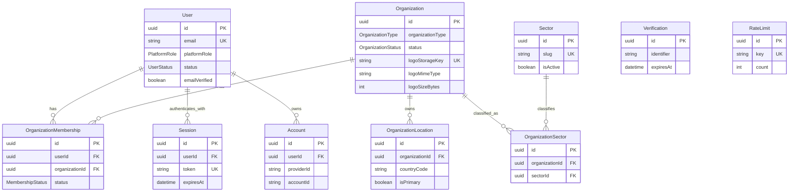
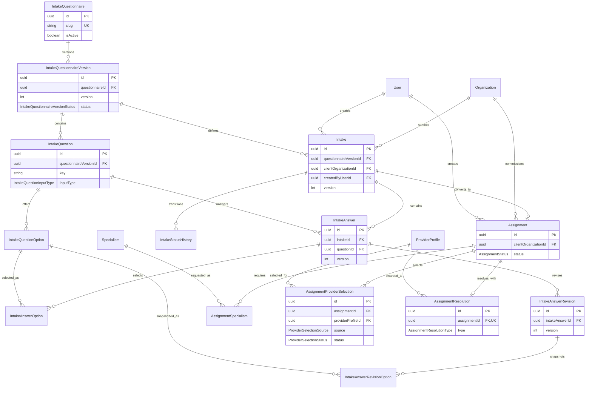
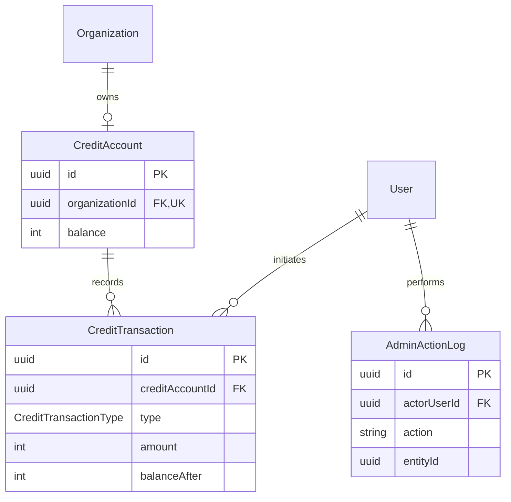

# ERD WorkMatchr

De ERD is per domein gesplitst voor leesbaarheid. Velden zijn beperkt tot primaire en relationele sleutels plus bepalende statussen.

## Identity en organisaties

## Aanbieders en expertise

```mermaid
erDiagram
  Organization ||--o| ProviderProfile : has
  ProviderProfile ||--o{ ProviderSpecialism : offers
  Specialism ||--o{ ProviderSpecialism : classifies
  Specialism ||--o{ Specialism : parent_of
  ProviderProfile ||--o{ ProviderSector : experienced_in
  Sector ||--o{ ProviderSector : classifies
  ProviderProfile ||--o{ ProviderCertification : holds
  Certification ||--o{ ProviderCertification : types
  User ||--o{ ProviderCertification : verifies
  ProviderProfile {
    uuid id PK
    uuid organizationId FK
    ProviderApprovalStatus approvalStatus
    boolean isAvailable
  }
  Specialism {
    uuid id PK
    uuid parentId FK
    string slug UK
  }
  Certification {
    uuid id PK
    string slug UK
  }
```

## Intake en opdrachten

## Credits en audit

