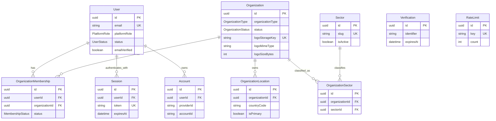
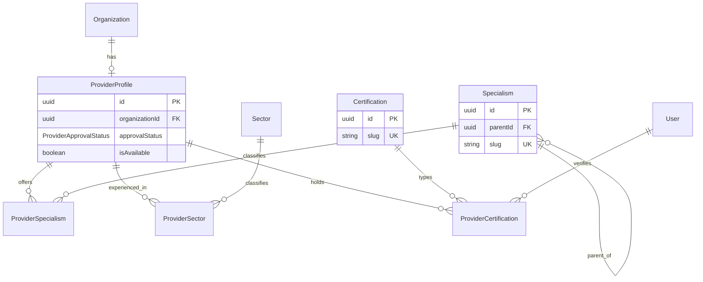
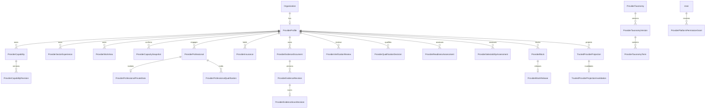
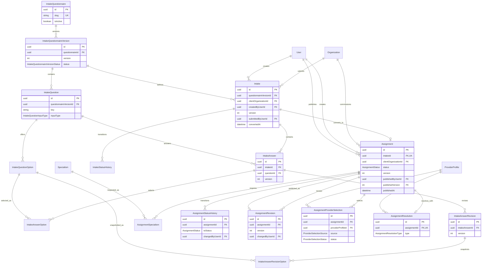
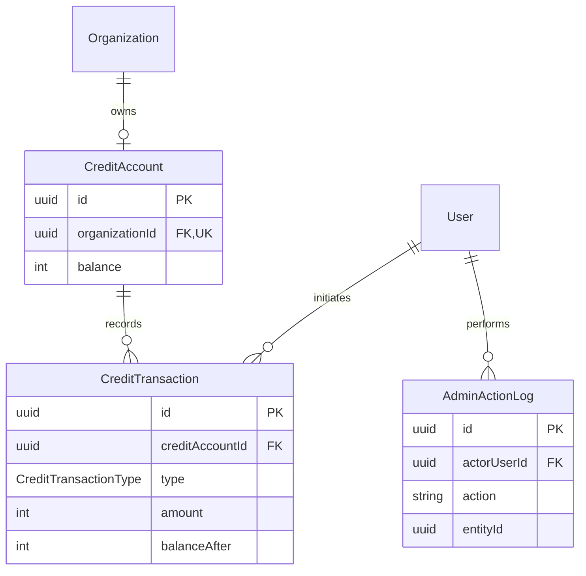

# ERD WorkMatchr

De ERD is per domein gesplitst voor leesbaarheid. Velden zijn beperkt tot primaire en relationele sleutels plus bepalende statussen.

## Identity en organisaties

## Aanbieders en expertise

## Providerkwalificatie Module 6A.2

Alle roots blijven aan één `ProviderProfile` gekoppeld. Revisions, reviews, besluiten, assessments, blokkades en projecties zijn append-only. `ProviderProfessionalPrivateData` en `ProviderEvidenceRevision` vallen bewust buiten de Trusted Provider Projection.

## Intake en opdrachten

## Credits en audit

