# ERD WorkMatchr

## Multi-Source Knowledge-uitbreiding

`KnowledgeSource` 1—N `KnowledgeSourceVersion` 1—N `KnowledgeSourceArtifact`. `KnowledgeSourceApplicability` verwijst via een database-XOR naar precies één `KnowledgeSource`, `KnowledgeSourceVersion` of `KnowledgeSourceBlock`. Bestaande structured-component- en methode-evidence blijven rechtstreeks naar immutable bronblokken verwijzen en erven daarmee canonieke identiteit, artifact en toepassingsscope.

## Marketplace Rules, credits en betrouwbaarheid

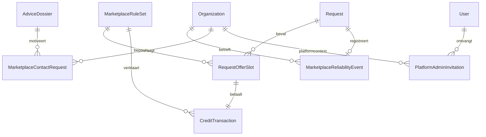
```mermaid
erDiagram
  MarketplaceRuleSet ||--o{ RequestOfferSlot : bepaalt
  MarketplaceRuleSet ||--o{ CreditTransaction : verklaart
  Request ||--o{ RequestOfferSlot : bevat
  RequestOfferSlot ||--|| CreditTransaction : betaalt
  Request ||--o| MarketplaceReliabilityEvent : registreert
  Organization ||--o{ MarketplaceReliabilityEvent : betreft
  AdviceDossier ||--o{ MarketplaceContactRequest : motiveert
  Organization ||--o{ MarketplaceContactRequest : vraagt
  Organization ||--o{ PlatformAdminInvitation : platformcontext
  User ||--o{ PlatformAdminInvitation : ontvangt
```

De ERD is per domein gesplitst voor leesbaarheid. Velden zijn beperkt tot primaire en relationele sleutels plus bepalende statussen.

## Publieke conceptintake — Module 7.1

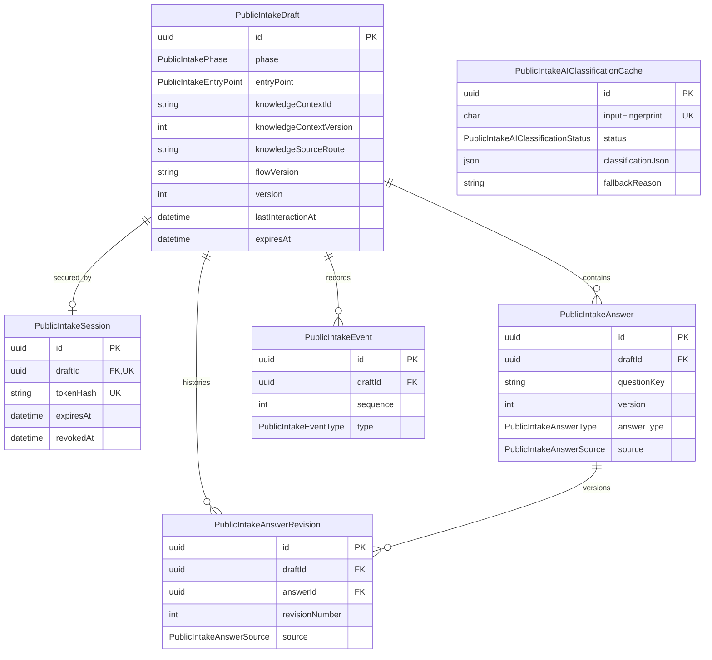
```mermaid
erDiagram
  PublicIntakeDraft ||--o| PublicIntakeSession : secured_by
  PublicIntakeDraft ||--o{ PublicIntakeAnswer : contains
  PublicIntakeDraft ||--o{ PublicIntakeAnswerRevision : histories
  PublicIntakeDraft ||--o{ PublicIntakeEvent : records
  PublicIntakeAnswer ||--o{ PublicIntakeAnswerRevision : versions
  PublicIntakeAIClassificationCache {
    uuid id PK
    char inputFingerprint UK
    PublicIntakeAIClassificationStatus status
    json classificationJson
    string fallbackReason
  }
  PublicIntakeDraft {
    uuid id PK
    PublicIntakePhase phase
    PublicIntakeEntryPoint entryPoint
    string knowledgeContextId
    int knowledgeContextVersion
    string knowledgeSourceRoute
    string flowVersion
    int version
    datetime lastInteractionAt
    datetime expiresAt
  }
  PublicIntakeSession {
    uuid id PK
    uuid draftId FK,UK
    string tokenHash UK
    datetime expiresAt
    datetime revokedAt
  }
  PublicIntakeAnswer {
    uuid id PK
    uuid draftId FK
    string questionKey
    int version
    PublicIntakeAnswerType answerType
    PublicIntakeAnswerSource source
  }
  PublicIntakeAnswerRevision {
    uuid id PK
    uuid draftId FK
    uuid answerId FK
    int revisionNumber
    PublicIntakeAnswerSource source
  }
  PublicIntakeEvent {
    uuid id PK
    uuid draftId FK
    int sequence
    PublicIntakeEventType type
  }
```

Dit domein heeft bewust geen relatie naar User, Organization, membership, Intake of Assignment. Het volledige toegangstoken wordt nooit opgeslagen; alleen de hash staat in `PublicIntakeSession`. Een bewuste reset verwijdert geen records: de draft krijgt terminaal `ABANDONED_BY_USER`, de sessie krijgt `revokedAt` en het append-only event bewaart uitsluitend fasecontext en reden. De losstaande classificatiecache bevat uitsluitend een niet-omkeerbare fingerprint en gevalideerde structured output of een veilige fallback; de vrije hulpvraag wordt niet gedupliceerd.

## Adviesdossiers — Module 7C

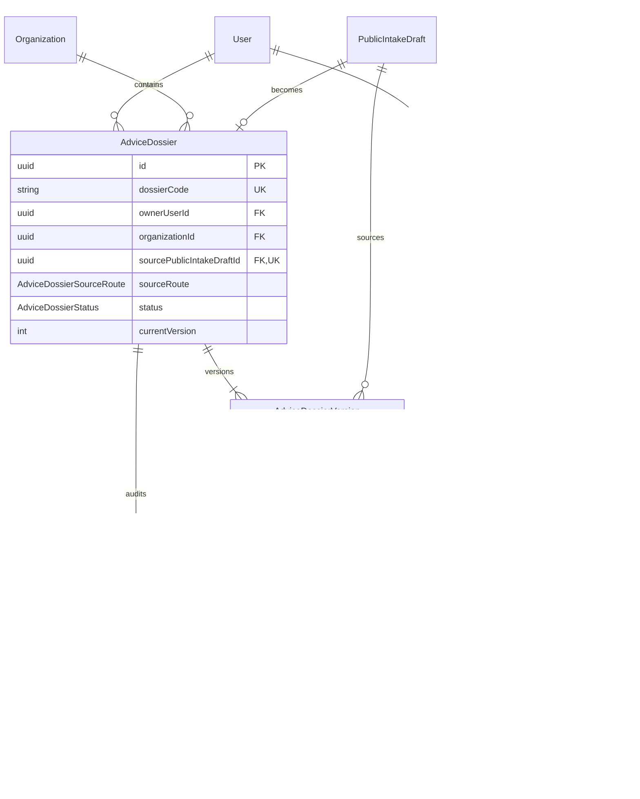
```mermaid
erDiagram
  User ||--o{ AdviceDossier : owns
  Organization ||--o{ AdviceDossier : contains
  PublicIntakeDraft ||--o| AdviceDossier : becomes
  AdviceDossier ||--|{ AdviceDossierVersion : versions
  PublicIntakeDraft ||--o{ AdviceDossierVersion : sources
  AdviceDossier ||--o{ AdviceDossierEvent : audits
  AdviceDossierVersion ||--o{ AdviceDossierEvent : referenced_by
  User ||--o{ AdviceDossierEvent : acts
  AdviceDossierCounter {
    int year PK
    int nextNumber
  }
  AdviceDossier {
    uuid id PK
    string dossierCode UK
    uuid ownerUserId FK
    uuid organizationId FK
    uuid sourcePublicIntakeDraftId FK,UK
    AdviceDossierSourceRoute sourceRoute
    AdviceDossierStatus status
    int currentVersion
  }
  AdviceDossierVersion {
    uuid id PK
    uuid adviceDossierId FK
    int version
    uuid sourcePublicIntakeDraftId FK
    int sourcePublicIntakeVersion
    json guidanceOutcome
    json professionalAdvice
  }
  AdviceDossierEvent {
    uuid id PK
    uuid adviceDossierId FK
    uuid adviceDossierVersionId FK
    uuid actorUserId FK
    AdviceDossierEventType type
  }
```

Een publieke draft blijft pseudoniem zolang geen ingelogde opdrachtgever de complete uitkomst laat vastleggen. De handoff creëert dan een afzonderlijk tenantgebonden dossier; de publieke draft zelf krijgt geen User- of Organization-FK. Dossierversies en events zijn databasebreed immutable. Een teller levert onder vergrendeling unieke, herkenbare codes zonder `count + 1`.

## Aanvraagpublicatie — Module 7D.1

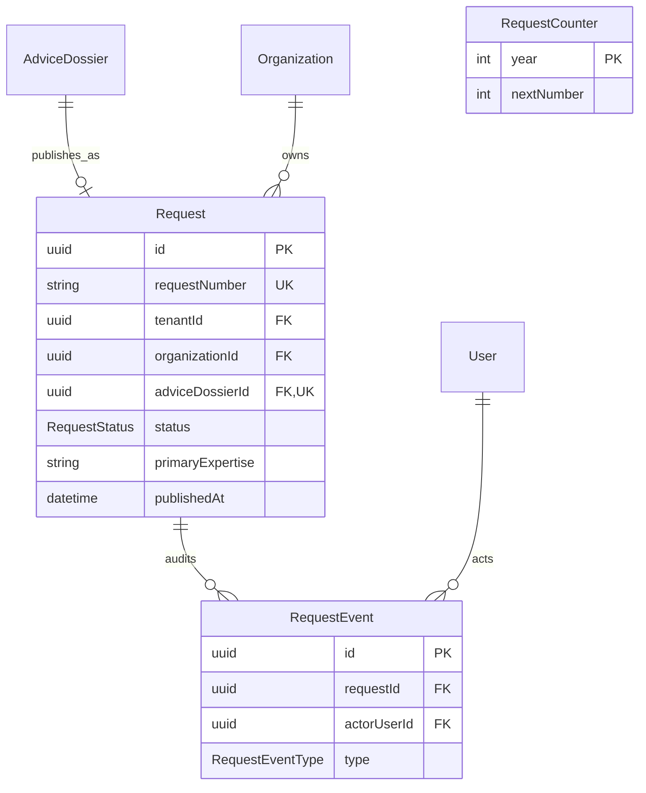
```mermaid
erDiagram
  AdviceDossier ||--o| Request : publishes_as
  Organization ||--o{ Request : owns
  Request ||--o{ RequestEvent : audits
  User ||--o{ RequestEvent : acts
  RequestCounter {
    int year PK
    int nextNumber
  }
  Request {
    uuid id PK
    string requestNumber UK
    uuid tenantId FK
    uuid organizationId FK
    uuid adviceDossierId FK,UK
    RequestStatus status
    string primaryExpertise
    datetime publishedAt
  }
  RequestEvent {
    uuid id PK
    uuid requestId FK
    uuid actorUserId FK
    RequestEventType type
  }
```

Een `Request` is niet het Adviesdossier zelf, maar een beperkte publicatiesnapshot. Eén afgerond dossier levert maximaal één aanvraag op. De dossiereigenaar blijft via de dossierrelatie de enige M7D.1-actor. Gepubliceerde inhoud en events zijn immutable; matching-, provider-, offerte- en creditrelaties ontbreken bewust.

## Module 7D.2 — doelgroep en interesse

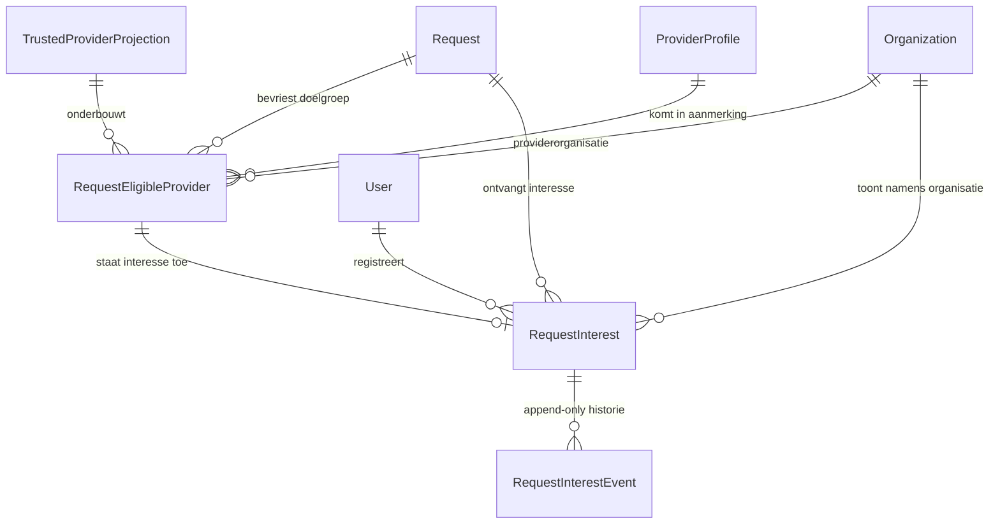
```mermaid
erDiagram
  Request ||--o{ RequestEligibleProvider : "bevriest doelgroep"
  TrustedProviderProjection ||--o{ RequestEligibleProvider : "onderbouwt"
  ProviderProfile ||--o{ RequestEligibleProvider : "komt in aanmerking"
  Organization ||--o{ RequestEligibleProvider : "providerorganisatie"
  RequestEligibleProvider ||--o| RequestInterest : "staat interesse toe"
  Request ||--o{ RequestInterest : "ontvangt interesse"
  Organization ||--o{ RequestInterest : "toont namens organisatie"
  User ||--o{ RequestInterest : "registreert"
  RequestInterest ||--o{ RequestInterestEvent : "append-only historie"
```

`RequestEligibleProvider(requestId, providerOrganizationId)` en `RequestInterest(requestId, providerOrganizationId)` zijn uniek. De samengestelde foreign key van interesse naar eligibility maakt een reactie buiten de publicatiedoelgroep onmogelijk.

## Module 7D.3 — offerteplaats claimen

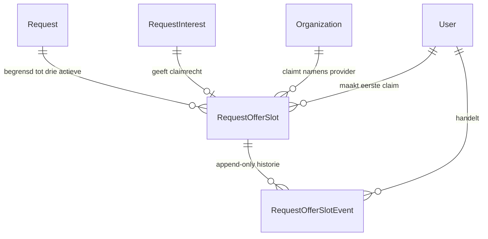
```mermaid
erDiagram
  Request ||--o{ RequestOfferSlot : "begrensd tot drie actieve"
  RequestInterest ||--o| RequestOfferSlot : "geeft claimrecht"
  Organization ||--o{ RequestOfferSlot : "claimt namens provider"
  User ||--o{ RequestOfferSlot : "maakt eerste claim"
  RequestOfferSlot ||--o{ RequestOfferSlotEvent : "append-only historie"
  User ||--o{ RequestOfferSlotEvent : "handelt"
```

`RequestOfferSlot(requestId, providerOrganizationId)` en `requestInterestId` zijn uniek. Een partial unique index op actieve `(requestId, slotNumber)`-waarden en de toegestane nummers 1–3 begrenzen het actieve totaal databasebreed. Contactgegevens maken geen deel uit van slot of event; zij worden alleen server-side geprojecteerd aan een organisatie met een actieve claim.

## Identity en organisaties

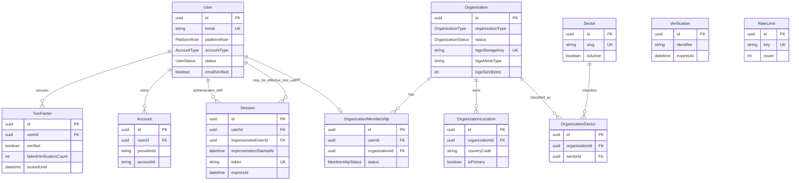
```mermaid
erDiagram
  User ||--o| OrganizationMembership : has
  User ||--o{ Session : authenticates_with
  User ||--o{ Session : may_be_effective_test_user
  User ||--o{ Account : owns
  User ||--o{ TwoFactor : secures
  Organization ||--o{ OrganizationMembership : has
  Organization ||--o{ OrganizationLocation : owns
  Organization ||--o{ OrganizationSector : classified_as
  Sector ||--o{ OrganizationSector : classifies
  User {
    uuid id PK
    string email UK
    PlatformRole platformRole
    AccountType accountType
    UserStatus status
    boolean emailVerified
  }
  Session {
    uuid id PK
    uuid userId FK
    uuid impersonatedUserId FK
    datetime impersonationStartedAt
    string token UK
    datetime expiresAt
  }
  Account {
    uuid id PK
    uuid userId FK
    string providerId
    string accountId
  }
  Verification {
    uuid id PK
    string identifier
    datetime expiresAt
  }
  RateLimit {
    uuid id PK
    string key UK
    int count
  }
  TwoFactor {
    uuid id PK
    uuid userId FK
    boolean verified
    int failedVerificationCount
    datetime lockedUntil
  }
  Organization {
    uuid id PK
    OrganizationType organizationType
    OrganizationStatus status
    string logoStorageKey UK
    string logoMimeType
    int logoSizeBytes
  }
  OrganizationMembership {
    uuid id PK
    uuid userId FK
    uuid organizationId FK
    MembershipStatus status
  }
  OrganizationLocation {
    uuid id PK
    uuid organizationId FK
    string countryCode
    boolean isPrimary
  }
  Sector {
    uuid id PK
    string slug UK
    boolean isActive
  }
  OrganizationSector {
    uuid id PK
    uuid organizationId FK
    uuid sectorId FK
  }
```

## ADR-013 Fase 1 — accountarchitectuur Expand

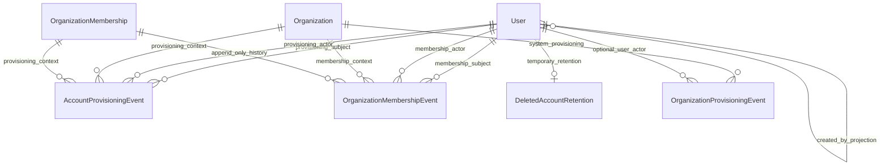
```mermaid
erDiagram
  User ||--o{ User : created_by_projection
  User ||--o{ AccountProvisioningEvent : provisioning_subject
  User ||--o{ AccountProvisioningEvent : provisioning_actor
  User ||--o{ OrganizationMembershipEvent : membership_subject
  User ||--o{ OrganizationMembershipEvent : membership_actor
  User ||--o| DeletedAccountRetention : temporary_retention
  Organization ||--o{ AccountProvisioningEvent : provisioning_context
  Organization ||--o{ OrganizationMembershipEvent : membership_context
  Organization ||--o{ OrganizationProvisioningEvent : system_provisioning
  User ||--o{ OrganizationProvisioningEvent : optional_user_actor
  OrganizationMembership ||--o{ AccountProvisioningEvent : provisioning_context
  OrganizationMembership ||--o{ OrganizationMembershipEvent : append_only_history
```

De drie eventmodellen zijn databasebreed append-only. `OrganizationProvisioningEvent` maakt systeemgedreven bootstrap expliciet zonder een fictieve User-actor. Retentie is geen authenticatiemodel. De doelconstraint van maximaal één membership per normale tenant-User is bewust nog niet toegevoegd.

## Aanbieders en expertise

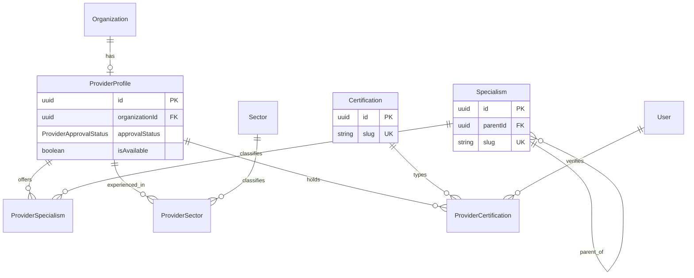
```mermaid
erDiagram
  Organization ||--o| ProviderProfile : has
  ProviderProfile ||--o{ ProviderSpecialism : offers
  Specialism ||--o{ ProviderSpecialism : classifies
  Specialism ||--o{ Specialism : parent_of
  ProviderProfile ||--o{ ProviderSector : experienced_in
  Sector ||--o{ ProviderSector : classifies
  ProviderProfile ||--o{ ProviderCertification : holds
  Certification ||--o{ ProviderCertification : types
  User ||--o{ ProviderCertification : verifies
  ProviderProfile {
    uuid id PK
    uuid organizationId FK
    ProviderApprovalStatus approvalStatus
    boolean isAvailable
  }
  Specialism {
    uuid id PK
    uuid parentId FK
    string slug UK
  }
  Certification {
    uuid id PK
    string slug UK
  }
```

## Providerkwalificatie Module 6A.2

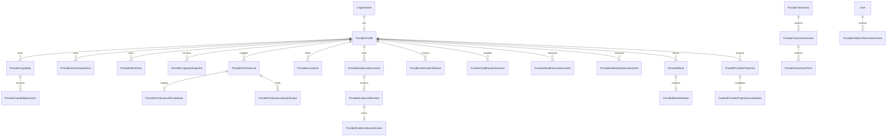
```mermaid
erDiagram
  Organization ||--o| ProviderProfile : has
  ProviderProfile ||--o{ ProviderCapability : owns
  ProviderCapability ||--o{ ProviderCapabilityRevision : versions
  ProviderProfile ||--o{ ProviderSectorExperience : owns
  ProviderProfile ||--o{ ProviderWorkArea : owns
  ProviderProfile ||--o{ ProviderCapacitySnapshot : confirms
  ProviderProfile ||--o{ ProviderProfessional : engages
  ProviderProfessional ||--o| ProviderProfessionalPrivateData : isolates
  ProviderProfessional ||--o{ ProviderProfessionalQualification : holds
  ProviderProfile ||--o{ ProviderInsurance : holds
  ProviderProfile ||--o{ ProviderEvidenceDocument : owns
  ProviderEvidenceDocument ||--o{ ProviderEvidenceRevision : versions
  ProviderEvidenceRevision ||--o| ProviderEvidenceScanDecision : scans
  ProviderTaxonomy ||--o{ ProviderTaxonomyVersion : versions
  ProviderTaxonomyVersion ||--o{ ProviderTaxonomyTerm : contains
  ProviderProfile ||--o{ ProviderVerificationReview : reviews
  ProviderProfile ||--o{ ProviderQualificationDecision : qualifies
  ProviderProfile ||--o{ ProviderReadinessAssessment : assesses
  ProviderProfile ||--o{ ProviderSelectabilityAssessment : assesses
  ProviderProfile ||--o{ ProviderBlock : blocks
  ProviderBlock ||--o| ProviderBlockRelease : releases
  ProviderProfile ||--o{ TrustedProviderProjection : projects
  TrustedProviderProjection ||--o| TrustedProviderProjectionInvalidation : invalidates
  User ||--o{ ProviderPlatformPermissionGrant : receives
```

Alle roots blijven aan één `ProviderProfile` gekoppeld. Revisions, reviews, besluiten, assessments, blokkades en projecties zijn append-only. `ProviderProfessionalPrivateData` en `ProviderEvidenceRevision` vallen bewust buiten de Trusted Provider Projection.

## Intake en opdrachten

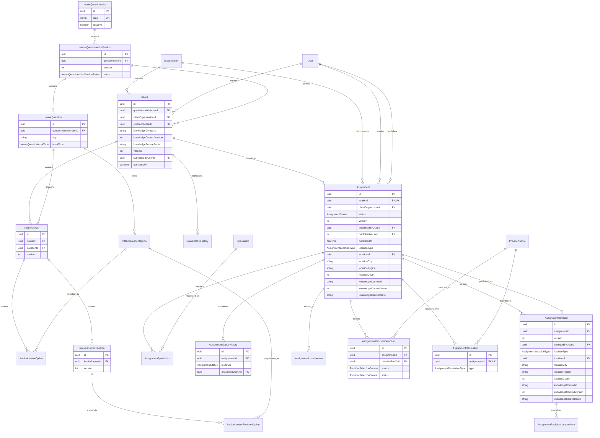
```mermaid
erDiagram
  Organization ||--o{ Intake : submits
  User ||--o{ Intake : creates
  IntakeQuestionnaire ||--o{ IntakeQuestionnaireVersion : versions
  IntakeQuestionnaireVersion ||--o{ IntakeQuestion : contains
  IntakeQuestion ||--o{ IntakeQuestionOption : offers
  IntakeQuestionnaireVersion ||--o{ Intake : defines
  Intake ||--o{ IntakeAnswer : contains
  IntakeQuestion ||--o{ IntakeAnswer : answers
  IntakeAnswer ||--o{ IntakeAnswerOption : selects
  IntakeQuestionOption ||--o{ IntakeAnswerOption : selected_as
  IntakeAnswer ||--o{ IntakeAnswerRevision : revises
  IntakeAnswerRevision ||--o{ IntakeAnswerRevisionOption : snapshots
  IntakeQuestionOption ||--o{ IntakeAnswerRevisionOption : snapshotted_as
  Intake ||--o{ IntakeStatusHistory : transitions
  Intake ||--o| Assignment : converts_to
  Organization ||--o{ Assignment : commissions
  User ||--o{ Assignment : creates
  User ||--o{ Assignment : publishes
  Assignment ||--o{ AssignmentSpecialism : requires
  Assignment ||--o{ AssignmentStatusHistory : transitions
  Assignment ||--o{ AssignmentRevision : revises
  Assignment ||--o{ AssignmentLocationItem : occurs_at
  AssignmentRevision ||--o{ AssignmentRevisionLocationItem : snapshots
  Assignment ||--o| AssignmentRevision : published_as
  Specialism ||--o{ AssignmentSpecialism : requested_as
  Assignment ||--o{ AssignmentProviderSelection : selects
  ProviderProfile ||--o{ AssignmentProviderSelection : selected_for
  Assignment ||--o| AssignmentResolution : resolves_with
  ProviderProfile ||--o{ AssignmentResolution : awarded_to
  IntakeQuestionnaire {
    uuid id PK
    string slug UK
    boolean isActive
  }
  IntakeQuestionnaireVersion {
    uuid id PK
    uuid questionnaireId FK
    int version
    IntakeQuestionnaireVersionStatus status
  }
  IntakeQuestion {
    uuid id PK
    uuid questionnaireVersionId FK
    string key
    IntakeQuestionInputType inputType
  }
  Intake {
    uuid id PK
    uuid questionnaireVersionId FK
    uuid clientOrganizationId FK
    uuid createdByUserId FK
    string knowledgeContextId
    int knowledgeContextVersion
    string knowledgeSourceRoute
    int version
    uuid submittedByUserId FK
    datetime convertedAt
  }
  IntakeAnswer {
    uuid id PK
    uuid intakeId FK
    uuid questionId FK
    int version
  }
  IntakeAnswerRevision {
    uuid id PK
    uuid intakeAnswerId FK
    int version
  }
  Assignment {
    uuid id PK
    uuid intakeId FK,UK
    uuid clientOrganizationId FK
    AssignmentStatus status
    int version
    uuid publishedByUserId FK
    int publishedVersion FK
    datetime publishedAt
    AssignmentLocationType locationType
    uuid locationId FK
    string locationCity
    string locationRegion
    int locationCount
    string knowledgeContextId
    int knowledgeContextVersion
    string knowledgeSourceRoute
  }
  AssignmentStatusHistory {
    uuid id PK
    uuid assignmentId FK
    AssignmentStatus toStatus
    uuid changedByUserId FK
  }
  AssignmentRevision {
    uuid id PK
    uuid assignmentId FK
    int version
    uuid changedByUserId FK
    AssignmentLocationType locationType
    uuid locationId FK
    string locationCity
    string locationRegion
    int locationCount
    string knowledgeContextId
    int knowledgeContextVersion
    string knowledgeSourceRoute
  }
  AssignmentProviderSelection {
    uuid id PK
    uuid assignmentId FK
    uuid providerProfileId FK
    ProviderSelectionSource source
    ProviderSelectionStatus status
  }
  AssignmentResolution {
    uuid id PK
    uuid assignmentId FK,UK
    AssignmentResolutionType type
  }
```

`Assignment.locationType` plus de `location*`-snapshotvelden is de actuele
bron. Bij `MULTIPLE` is de geordende `AssignmentLocationItem`-collectie leidend en bevriest `AssignmentRevisionLocationItem` dezelfde lijst. `OrganizationLocation` is bij `REGISTERED` alleen de gevalideerde
bronreferentie. Iedere inhoudsrevisie kopieert het volledige locatieblok, zodat
een publicatiesnapshot niet verandert wanneer een organisatielocatie later wordt
aangepast. `OTHER`, `MULTIPLE`, `REMOTE` en `UNKNOWN` hebben geen locatie-FK.

## Providerdossierworkflow

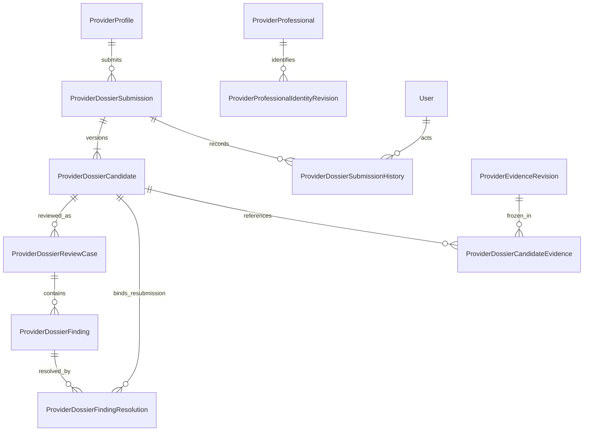
```mermaid
erDiagram
  ProviderProfile ||--o{ ProviderDossierSubmission : submits
  ProviderDossierSubmission ||--|{ ProviderDossierCandidate : versions
  ProviderDossierSubmission ||--o{ ProviderDossierSubmissionHistory : records
  ProviderDossierCandidate ||--o{ ProviderDossierReviewCase : reviewed_as
  ProviderDossierReviewCase ||--o{ ProviderDossierFinding : contains
  ProviderDossierFinding ||--o{ ProviderDossierFindingResolution : resolved_by
  ProviderDossierCandidate ||--o{ ProviderDossierFindingResolution : binds_resubmission
  ProviderDossierCandidate ||--o{ ProviderDossierCandidateEvidence : references
  ProviderEvidenceRevision ||--o{ ProviderDossierCandidateEvidence : frozen_in
  ProviderProfessional ||--o{ ProviderProfessionalIdentityRevision : identifies
  User ||--o{ ProviderDossierSubmissionHistory : acts
```

`ProviderDossierCandidate` en alle historie-/finding-/resolutionrecords zijn immutable. Nieuwe herindieningsresoluties zijn aan de nieuwe candidate gebonden; historische resolutions blijven zonder fictieve backfill geldig. Partial unique indexes bewaken één actieve submission en één open reviewcase per provider.

## Knowledge Control Workflow

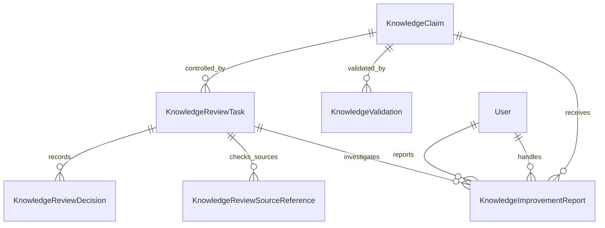
```mermaid
erDiagram
  KnowledgeClaim ||--o{ KnowledgeReviewTask : controlled_by
  KnowledgeReviewTask ||--o{ KnowledgeReviewDecision : records
  KnowledgeReviewTask ||--o{ KnowledgeReviewSourceReference : checks_sources
  KnowledgeClaim ||--o{ KnowledgeValidation : validated_by
  KnowledgeClaim ||--o{ KnowledgeImprovementReport : receives
  KnowledgeReviewTask ||--o{ KnowledgeImprovementReport : investigates
  User ||--o{ KnowledgeImprovementReport : reports
  User ||--o{ KnowledgeImprovementReport : handles
```

`KnowledgeClaim` bewaart de actuele risicoklasse en broncontrolestatus. `KnowledgeReviewTask.requiresHumanAction` en de getypeerde uitzonderingsreden bepalen of een taak in de menselijke werkvoorraad verschijnt; deactivatie verwijdert de taak niet. De append-only beslissingen, bronreferenties, validaties en auditevents blijven de herleidbare historie. Een `KnowledgeImprovementReport` koppelt een professioneel signaal aan precies één claim en één controletaak, maar muteert de gepubliceerde kennis niet rechtstreeks.

## Dienstverlenersprofiel v1

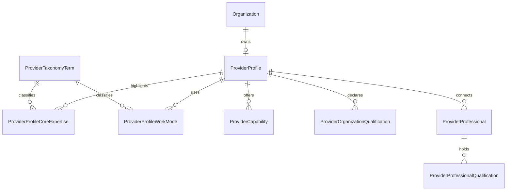
```mermaid
erDiagram
  Organization ||--o| ProviderProfile : owns
  ProviderProfile ||--o{ ProviderProfileCoreExpertise : highlights
  ProviderTaxonomyTerm ||--o{ ProviderProfileCoreExpertise : classifies
  ProviderProfile ||--o{ ProviderProfileWorkMode : uses
  ProviderTaxonomyTerm ||--o{ ProviderProfileWorkMode : classifies
  ProviderProfile ||--o{ ProviderCapability : offers
  ProviderProfile ||--o{ ProviderOrganizationQualification : declares
  ProviderProfile ||--o{ ProviderProfessional : connects
  ProviderProfessional ||--o{ ProviderProfessionalQualification : holds
```

Profielvolledigheid is afgeleid en wordt niet opgeslagen. Beschikbaarheid en capaciteit maken geen deel uit van dit profielmodel.

## Credits en audit

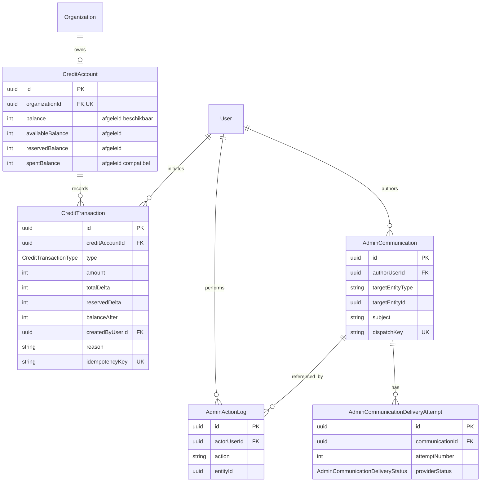
```mermaid
erDiagram
  Organization ||--o| CreditAccount : owns
  CreditAccount ||--o{ CreditTransaction : records
  User ||--o{ CreditTransaction : initiates
  User ||--o{ AdminActionLog : performs
  User ||--o{ AdminCommunication : authors
  AdminCommunication ||--o{ AdminCommunicationDeliveryAttempt : has
  AdminCommunication ||--o{ AdminActionLog : referenced_by
  CreditAccount {
    uuid id PK
    uuid organizationId FK,UK
    int balance "afgeleid beschikbaar"
    int availableBalance "afgeleid"
    int reservedBalance "afgeleid"
    int spentBalance "afgeleid compatibel"
  }
  CreditTransaction {
    uuid id PK
    uuid creditAccountId FK
    CreditTransactionType type
    int amount
    int totalDelta
    int reservedDelta
    int balanceAfter
    uuid createdByUserId FK
    string reason
    string idempotencyKey UK
  }
  AdminActionLog {
    uuid id PK
    uuid actorUserId FK
    string action
    uuid entityId
  }
  AdminCommunication {
    uuid id PK
    uuid authorUserId FK
    string targetEntityType
    uuid targetEntityId
    string subject
    string dispatchKey UK
  }
  AdminCommunicationDeliveryAttempt {
    uuid id PK
    uuid communicationId FK
    int attemptNumber
    AdminCommunicationDeliveryStatus providerStatus
  }
```

## Marketplace Transaction Platform v1

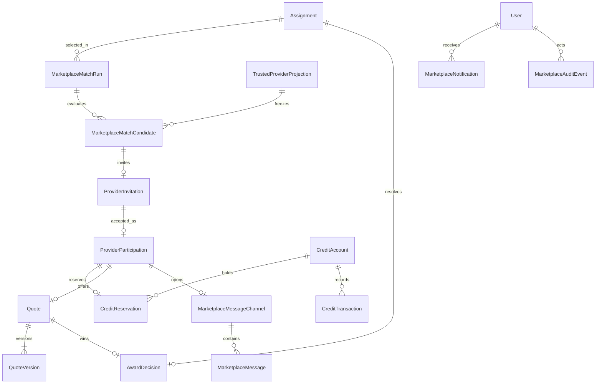
```mermaid
erDiagram
  Assignment ||--o{ MarketplaceMatchRun : selected_in
  MarketplaceMatchRun ||--o{ MarketplaceMatchCandidate : evaluates
  TrustedProviderProjection ||--o{ MarketplaceMatchCandidate : freezes
  MarketplaceMatchCandidate ||--o| ProviderInvitation : invites
  ProviderInvitation ||--o| ProviderParticipation : accepted_as
  ProviderParticipation ||--o| CreditReservation : reserves
  ProviderParticipation ||--o| Quote : offers
  Quote ||--|{ QuoteVersion : versions
  Quote ||--o| AwardDecision : wins
  Assignment ||--o| AwardDecision : resolves
  CreditAccount ||--o{ CreditReservation : holds
  CreditAccount ||--o{ CreditTransaction : records
  ProviderParticipation ||--o| MarketplaceMessageChannel : opens
  MarketplaceMessageChannel ||--o{ MarketplaceMessage : contains
  User ||--o{ MarketplaceNotification : receives
  User ||--o{ MarketplaceAuditEvent : acts
```

Kandidaten, interventies, offerteversies, gunningen, ledgerregels en marktaudit zijn append-only. Unieke relaties voorkomen dubbele uitnodiging, deelname, offerte, reservering en gunning.

## Financiële keten F3-F9

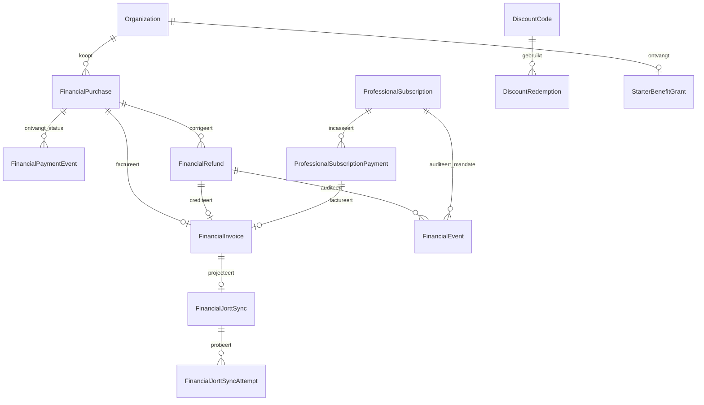
```mermaid
erDiagram
  Organization ||--o{ FinancialPurchase : koopt
  FinancialPurchase ||--o{ FinancialPaymentEvent : ontvangt_status
  FinancialPurchase ||--o| FinancialInvoice : factureert
  FinancialPurchase ||--o{ FinancialRefund : corrigeert
  FinancialRefund ||--o| FinancialInvoice : crediteert
  FinancialRefund ||--o{ FinancialEvent : auditeert
  ProfessionalSubscription ||--o{ FinancialEvent : auditeert_mandate
  ProfessionalSubscription ||--o{ ProfessionalSubscriptionPayment : incasseert
  ProfessionalSubscriptionPayment ||--o| FinancialInvoice : factureert
  FinancialInvoice ||--o| FinancialJorttSync : projecteert
  FinancialJorttSync ||--o{ FinancialJorttSyncAttempt : probeert
  DiscountCode ||--o{ DiscountRedemption : gebruikt
  Organization ||--o| StarterBenefitGrant : ontvangt
```

Een Pro-abonnement bewaart uitsluitend de Mollie customer-, mandate- en subscription-identifiers plus de gevalideerde mandate-status, methode en verificatietijd. Een iDEAL-first-payment levert bij een geactiveerde SEPA-methode een direct-debit-mandate op; kaart blijft een afzonderlijk geldig alternatief. Gevoelige rekening- en kaartgegevens blijven uitsluitend bij Mollie.
## ADR-013 Contract — enkelvoudige tenantcontext

`OrganizationMembership.userId` is databasebreed uniek. Een User heeft daardoor nul of één actuele membership; één organisatie kan nog steeds meerdere memberships en dus meerdere afzonderlijke gebruikersaccounts hebben. De nulvariant ondersteunt expliciete platformaccounts en nog niet afgeronde eerste onboarding. Actorrelaties en append-only eventrelaties blijven ongewijzigd.
# Knowledge Engine

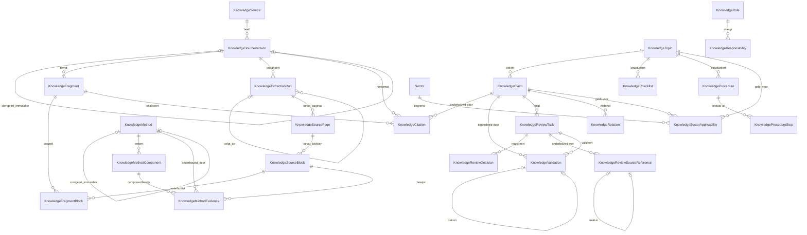
```mermaid
erDiagram
  KnowledgeSource ||--o{ KnowledgeSourceVersion : heeft
  KnowledgeSourceVersion o|--o| KnowledgeSourceVersion : corrigeert_immutable
  KnowledgeSourceVersion ||--o{ KnowledgeFragment : bevat
  KnowledgeSourceVersion ||--o{ KnowledgeExtractionRun : extraheert
  KnowledgeExtractionRun o|--o{ KnowledgeExtractionRun : volgt_op
  KnowledgeExtractionRun ||--o{ KnowledgeSourcePage : bevat_paginas
  KnowledgeSourcePage ||--o{ KnowledgeSourceBlock : bevat_blokken
  KnowledgeFragment ||--o{ KnowledgeFragmentBlock : koppelt
  KnowledgeSourceBlock ||--o{ KnowledgeFragmentBlock : onderbouwt
  KnowledgeMethod o|--o| KnowledgeMethod : corrigeert_immutable
  KnowledgeMethod ||--o{ KnowledgeMethodComponent : ordent
  KnowledgeMethod ||--o{ KnowledgeMethodEvidence : onderbouwd_door
  KnowledgeMethodComponent ||--o{ KnowledgeMethodEvidence : componentbewijs
  KnowledgeSourceBlock ||--o{ KnowledgeMethodEvidence : bewijst
  KnowledgeTopic ||--o{ KnowledgeClaim : ordent
  KnowledgeClaim ||--o{ KnowledgeCitation : onderbouwd-door
  KnowledgeSourceVersion ||--o{ KnowledgeCitation : herkomst
  KnowledgeFragment ||--o{ KnowledgeCitation : lokaliseert
  KnowledgeClaim ||--o{ KnowledgeValidation : beoordeeld-door
  KnowledgeClaim ||--o{ KnowledgeReviewTask : krijgt
  KnowledgeReviewTask ||--o{ KnowledgeReviewDecision : registreert
  KnowledgeReviewTask ||--o{ KnowledgeReviewSourceReference : onderbouwd-met
  KnowledgeReviewTask ||--o{ KnowledgeValidation : valideert
  KnowledgeValidation o|--o| KnowledgeValidation : trekt-in
  KnowledgeReviewSourceReference o|--o| KnowledgeReviewSourceReference : trekt-in
  KnowledgeClaim ||--o{ KnowledgeRelation : verbindt
  KnowledgeTopic ||--o{ KnowledgeChecklist : structureert
  KnowledgeTopic ||--o{ KnowledgeProcedure : structureert
  Sector ||--o{ KnowledgeSectorApplicability : begrenst
  KnowledgeTopic ||--o{ KnowledgeSectorApplicability : geldt-voor
  KnowledgeClaim ||--o{ KnowledgeSectorApplicability : geldt-voor
  KnowledgeProcedure ||--o{ KnowledgeProcedureStep : bestaat-uit
  KnowledgeRole ||--o{ KnowledgeResponsibility : draagt
```

`KnowledgeSource` bewaart alleen bronmetadata en een relatief logisch manifestpad. De generieke import voegt `sourceModifiedDate`, `applicabilityScope` en de fail-closed `metadataStatus` toe; de originele lokale bron blijft buiten database en Git. Iedere `KnowledgeClaim` blijft via `KnowledgeCitation` en `KnowledgeFragment` herleidbaar tot een bronversie en pagina of sectie. Een inhoudelijke importcorrectie schrijft een nieuwe `KnowledgeSourceVersion.importRevision` met `contentFingerprint` en een unieke `supersedesVersionId`; de eerdere revisie en haar kennisrecords blijven ongewijzigd aanwezig.

`KnowledgeExtractionRun`, `KnowledgeSourcePage`, `KnowledgeSourceBlock` en `KnowledgeFragmentBlock` vormen de aanvullende interne volledige bronlaag. Alle records zijn immutable. Een nieuwe extractorconfiguratie schrijft een opvolgende run; zij herschrijft nooit de bronversie, bestaande fragmenten, claims of citaties. De zoekprojectie op bronblokken is intern en verleent geen validatie- of publicatiestatus.

`KnowledgeMethod` aggregeert bestaande gestructureerde kennisobjecten via geordende XOR-componenten. Methode-, component- en evidencerecords zijn immutable; evidence verwijst rechtstreeks naar full-source-blokken en iedere component moet bij transactiesluiting bewijs hebben.

`KnowledgeSectorApplicability` hergebruikt de centrale sectortaxonomie en koppelt een sector aan exact één onderwerp of claim. De koppeling is append-only; bestaande kennis, sectoren en historie worden niet herschreven.
