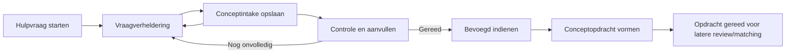
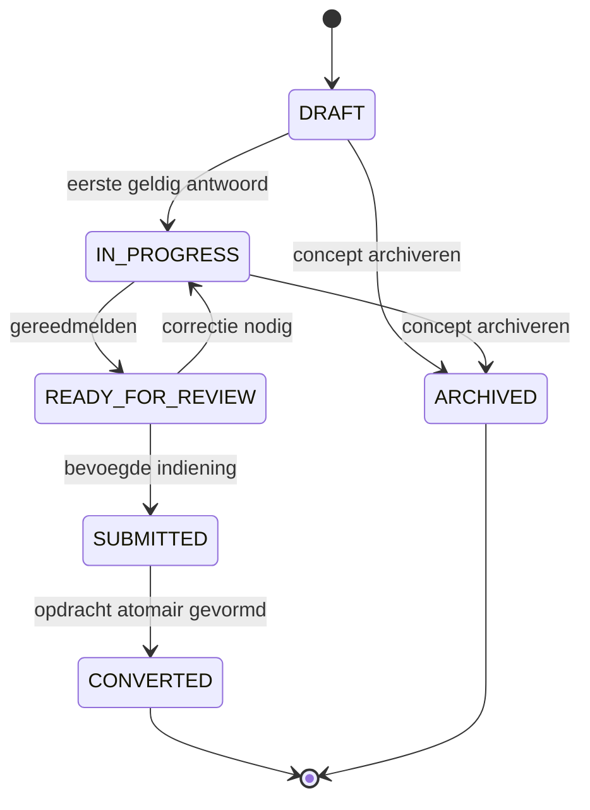
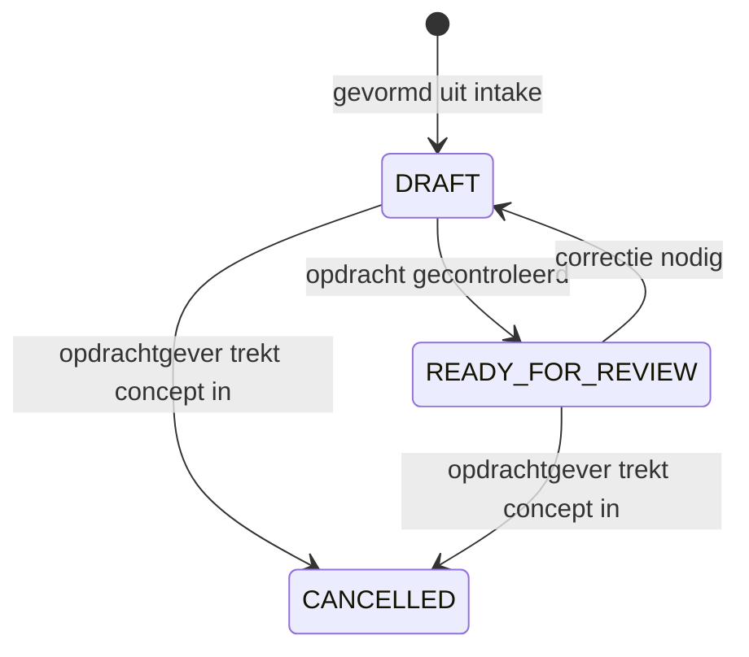

# Ontwerp Module 5 — Vraagverheldering, intake en opdrachten

- **Status:** leidend ontwerp; Module 5A.1, 5A.2 en 5A.3 technisch gerealiseerd, acceptatie en Module 5B staan nog open
- **Module:** 5
- **Afhankelijk van:** afgeronde Modules 3, 4A en 4B
- **Buiten scope:** matching, aanbieders, credits, Mollie-betalingen en AI

## 1. Doel en scope

Module 5 bouwt de eerste functionele opdrachtgeversflow van WorkMatchr. Een gebruiker hoeft niet vooraf te weten welke specialist nodig is. De applicatie helpt de gebruiker de situatie en gewenste uitkomst gestructureerd te beschrijven, bewaart dit als conceptintake en vormt na controle en bevoegde indiening maximaal één conceptopdracht.

De module levert:

- een beveiligde start voor een nieuwe hulpvraag binnen een actieve opdrachtgeverorganisatie;
- vaste, Nederlandstalige vragen die de situatie stap voor stap verduidelijken;
- tussentijds opslaan en hervatten van een conceptintake;
- een controlepagina met ontbrekende of ongeldige velden;
- een expliciete indieningshandeling door een bevoegde gebruiker;
- transactionele vorming van één conceptopdracht uit één intake;
- een overzicht en detailpagina voor eigen intakes en gevormde opdrachten;
- server-side tenantautorisatie, statusbewaking, validatie en concurrencycontrole;
- een datamodel dat toekomstige vraagboomversies ondersteunt zonder nu AI of matching te activeren.

Module 5 maakt geen aanbiedersselectie en publiceert geen opdracht aan aanbieders. Een gevormde opdracht eindigt binnen deze module uiterlijk in `READY_FOR_REVIEW`; de overgang naar `OPEN` of `MATCHING` hoort bij een latere matchingmodule.

## 2. Gebruikersflow opdrachtgever

### 2.1 Hulpvraag starten

1. De gebruiker kiest in de applicatie **Nieuwe hulpvraag**.
2. De server controleert een actieve gebruiker, actieve membership en een actieve organisatie van type `CLIENT` of `BOTH`.
3. Bij meerdere organisaties kiest de gebruiker eerst een geldige actieve organisatie. De organisatiecookie blijft alleen een keuzehulp; iedere mutatie valideert de membership opnieuw.
4. De gebruiker voert een korte eerste omschrijving in. Pas daarna ontstaat een `Intake` met status `DRAFT`.
5. De publieke homepage mag naar deze flow verwijzen, maar vrije tekst wordt niet via queryparameters, logs of tijdelijke servercookies meegenomen. Een niet-ingelogde gebruiker authenticeert vóór persistente opslag.

### 2.2 Vraagverheldering

- De intake toont één logisch onderwerp per stap en een rustige voortgangsindicatie.
- De gebruiker kan vooruit en terug zonder eerder opgeslagen antwoorden te verliezen.
- Na het eerste geldige antwoord gaat de intake van `DRAFT` naar `IN_PROGRESS`.
- Antwoorden worden server-side gevalideerd tegen de vastgezette vraagsetversie van de intake.
- Opslaan gebeurt expliciet per stap of met een gecontroleerde autosave; de interface toont de laatst bevestigde opslagstatus.
- Validatiefouten staan bij het betreffende veld, behouden alle invoer en focussen het eerste foutveld.

### 2.3 Conceptintake

- Een concept kan veilig worden verlaten en later worden hervat.
- Een overzicht toont eigenaar, status, laatste wijziging en ontbrekende onderdelen.
- Alleen niet-gearchiveerde concepten zijn normaal wijzigbaar.
- Gelijktijdige wijzigingen gebruiken optimistische concurrencycontrole. Een achterhaalde versie wordt niet stilzwijgend overschreven.

### 2.4 Controle

- De controlepagina toont de hulpvraag en antwoorden in begrijpelijke secties.
- De server voert de volledige validatie opnieuw uit; clientvalidatie is uitsluitend gebruikersondersteuning.
- Een `MEMBER` kan een eigen intake markeren als `READY_FOR_REVIEW`.
- `OWNER` en `ADMIN` kunnen iedere intake van de organisatie controleren, terugzetten naar `IN_PROGRESS` of gereedmaken.
- De interface maakt duidelijk dat nog geen aanbieder is geselecteerd en dat indienen nog geen matching start.

### 2.5 Indienen

- Alleen `OWNER` en `ADMIN` kunnen een `READY_FOR_REVIEW`-intake indienen.
- De actie vereist een expliciete bevestiging en herhaalt autorisatie, status- en volledigheidscontrole server-side.
- De actie is idempotent: dubbel klikken of een herhaald request kan nooit twee opdrachten vormen.
- Na indiening zijn de gebruikte intakevragen en antwoorden een historisch snapshot en niet meer inhoudelijk wijzigbaar.

### 2.6 Opdrachtvorming

In één databasetransactie:

1. wordt de intake gevalideerd en kort als `SUBMITTED` geregistreerd in de statushistorie;
2. ontstaat maximaal één `Assignment` met status `DRAFT`;
3. worden titel, omschrijving, sector, locatie, planning en relevante specialismen alleen uit gevalideerde intakegegevens afgeleid;
4. wordt de intake op `CONVERTED` gezet en worden `submittedAt`, `submittedByUserId` en `convertedAt` vastgelegd;
5. wordt een statushistorieregel voor intake en opdracht toegevoegd.

`OWNER` en `ADMIN` mogen de gevormde conceptopdracht controleren en markeren als `READY_FOR_REVIEW`. `OPEN`, `MATCHING` en alle aanbiedergerelateerde statussen blijven in Module 5 geblokkeerd.

## 3. Rollen en autorisaties

De platformrol `ADMIN` geeft niet automatisch toegang tot organisatiegegevens. Onderstaande bevoegdheden volgen uitsluitend uit een actuele, actieve `OrganizationMembership`.

| Handeling | `OWNER` | `ADMIN` | `MEMBER` |
| --- | --- | --- | --- |
| Eigen intake starten | Ja | Ja | Ja |
| Eigen `DRAFT`/`IN_PROGRESS` wijzigen | Ja | Ja | Ja |
| Alle intakes van de organisatie bekijken | Ja | Ja | Nee |
| Intake van een ander wijzigen | Ja, vóór indiening | Ja, vóór indiening | Nee |
| Eigen intake markeren als `READY_FOR_REVIEW` | Ja | Ja | Ja |
| Intake terugzetten naar `IN_PROGRESS` | Ja | Ja | Alleen eigen intake vanuit `READY_FOR_REVIEW` |
| Intake indienen en opdracht vormen | Ja | Ja | Nee |
| Conceptintake archiveren | Ja | Ja | Alleen eigen `DRAFT`/`IN_PROGRESS` |
| Gevormde opdracht bekijken | Ja | Ja | Alleen wanneer deze uit de eigen intake komt |
| Gevormde opdracht wijzigen of gereedmelden | Ja | Ja | Nee |

Aanvullende regels:

- gebruiker, membership en organisatie moeten actueel actief zijn;
- de organisatie moet type `CLIENT` of `BOTH` hebben;
- een organizationId, intakeId of assignmentId uit cookie, URL of formulier is nooit een autorisatiebron;
- toegang wordt server-side gecontroleerd dicht bij iedere lees- en schrijfactie;
- `SUSPENDED` en `ARCHIVED` organisaties kunnen niet wijzigen of indienen;
- wanneer de maker geen actieve membership meer heeft, kunnen `OWNER` en `ADMIN` het concept beheren;
- foutmeldingen onthullen niet of een niet-toegankelijke intake of opdracht bestaat.

## 4. Statusmodel

### 4.1 Intake

De bestaande `IntakeStatus` blijft de basis.

| Status | Betekenis | Wijzigbaarheid |
| --- | --- | --- |
| `DRAFT` | Eerste hulpvraag is opgeslagen; vraagverheldering kan starten. | Maker, `OWNER`, `ADMIN` |
| `IN_PROGRESS` | Minimaal één antwoord is opgeslagen, maar de intake is nog niet gereed. | Maker, `OWNER`, `ADMIN` |
| `READY_FOR_REVIEW` | Volledigheidsvalidatie slaagt; bevoegde controle en indiening zijn mogelijk. | Alleen gecontroleerd terugzetten of indienen |
| `SUBMITTED` | Indiening is geregistreerd binnen de conversietransactie. | Niet inhoudelijk wijzigbaar |
| `CONVERTED` | Exact één conceptopdracht is gevormd. | Intake is historisch snapshot |
| `ARCHIVED` | Een nog niet ingediende intake is ingetrokken. | Niet normaal wijzigbaar |

`SUBMITTED` is geen langdurige tussenstatus: de indieningsservice registreert deze overgang en vormt in dezelfde transactie de opdracht. Bij een fout rolt de volledige transactie terug naar `READY_FOR_REVIEW`.

### 4.2 Opdracht

Module 5 gebruikt slechts het eerste deel van de bestaande `AssignmentStatus`.

- `DRAFT`: gevormd uit een ingediende intake en nog intern wijzigbaar door `OWNER`/`ADMIN`.
- `READY_FOR_REVIEW`: gereed voor een toekomstige publicatie- of matchingstap.
- `CANCELLED`: ingetrokken vóór matching.
- `OPEN`, `MATCHING`, `AWAITING_RESPONSES`, `IN_SELECTION`, `AWARDED` en `CLOSED` worden in Module 5 niet aangeboden en server-side geweigerd.
- `ARCHIVED` blijft een latere beheer-/bewaarhandeling en is geen normale gebruikersactie in Module 5.

Alle toegestane overgangen lopen via centrale services. Directe statusupdates vanuit pagina’s of componenten zijn niet toegestaan.

## 5. Datamodelvoorstel

Dit voorstel breidt de bestaande modellen uit via nieuwe, controleerbare Prisma-migraties. Bestaande toegepaste migraties worden niet aangepast.

### 5.1 Bestaande modellen uitbreiden

#### `Intake`

- maak `clientOrganizationId` en `createdByUserId` verplicht voor de functionele Module 5-flow;
- behoud `freeText` als de oorspronkelijke korte hulpvraag;
- voeg `questionnaireVersionId` toe als verplichte verwijzing naar de bij start vastgezette vraagsetversie;
- voeg `submittedByUserId`, `convertedAt` en `version` toe;
- behoud `detectedSpecialismId` optioneel en leeg in Module 5; zonder AI wordt niets automatisch gedetecteerd;
- vervang de 1:n-semantiek naar opdrachten door maximaal één opdracht per intake.

#### `Assignment`

- maak `intakeId` uniek zodra de bestaande data dit toelaat;
- voeg `version` toe voor optimistische concurrencycontrole;
- voeg eventueel `readyForReviewAt` en `readyForReviewByUserId` toe wanneer deze actor/tijd niet betrouwbaar uit statushistorie wordt afgeleid;
- behoud bestaande velden voor titel, omschrijving, sector, locatie, planning en specialismen.

### 5.2 Nieuwe tabellen

| Tabel | Doel | Belangrijkste velden |
| --- | --- | --- |
| `IntakeQuestionnaire` | Stabiele identiteit van een vraagstructuur. | `id`, unieke `slug`, `name`, `isActive`, timestamps |
| `IntakeQuestionnaireVersion` | Onveranderlijke gepubliceerde versie. | `id`, `questionnaireId`, `version`, `status`, `publishedAt`, timestamps |
| `IntakeQuestion` | Vraag binnen één versie. | `id`, `questionnaireVersionId`, `key`, `category`, `inputType`, `label`, `helpText`, `isRequired`, `sortOrder`, validatiegrenzen |
| `IntakeQuestionOption` | Toegestane keuze bij single- of multiselect. | `id`, `questionId`, `value`, `label`, `sortOrder`, `isActive` |
| `IntakeAnswer` | Actuele antwoordwaarde op één vraag voor één intake. | `id`, `intakeId`, `questionId`, `version`, `textValue`, `numberValue`, `booleanValue`, `dateValue`, `organizationLocationId`, `updatedByUserId`, timestamps |
| `IntakeAnswerOption` | Geselecteerde opties voor keuzevragen. | `intakeAnswerId`, `optionId` |
| `IntakeAnswerRevision` | Append-only snapshot van iedere succesvol opgeslagen antwoordversie. | `id`, `intakeAnswerId`, `version`, getypeerde waardekolommen, `changedByUserId`, `createdAt` |
| `IntakeAnswerRevisionOption` | Opties die bij één historische antwoordversie hoorden. | `intakeAnswerRevisionId`, `optionId` |
| `IntakeStatusHistory` | Zakelijke historie van statusovergangen. | `id`, `intakeId`, `fromStatus`, `toStatus`, `changedByUserId`, `reason`, `createdAt` |
| `AssignmentStatusHistory` | Zakelijke historie van opdrachtstatussen. | `id`, `assignmentId`, `fromStatus`, `toStatus`, `changedByUserId`, `reason`, `createdAt` |

Statushistorie is noodzakelijke bedrijfsinformatie en vervangt niet de later geplande algemene auditlogging.

Voorgestelde technische enums:

- `IntakeQuestionnaireVersionStatus`: `DRAFT`, `PUBLISHED`, `RETIRED`;
- `IntakeQuestionCategory`: `HELP_REQUEST`, `DESIRED_OUTCOME`, `SITUATION`, `IMPACT`, `URGENCY`, `LOCATION`, `WORK_MODE`, `PLANNING`, `CONSTRAINTS`;
- `IntakeQuestionInputType`: `SHORT_TEXT`, `LONG_TEXT`, `NUMBER`, `BOOLEAN`, `DATE`, `SINGLE_SELECT`, `MULTI_SELECT`, `ORGANIZATION_LOCATION`.

### 5.3 Belangrijke constraints en indexen

- unieke `IntakeQuestionnaire.slug`;
- unieke `questionnaireId + version`;
- maximaal één actuele `PUBLISHED`-versie per questionnaire, geborgd met een PostgreSQL-partiële unieke index of gelijkwaardige transactionele publicatieservice;
- unieke `questionnaireVersionId + key` en `questionnaireVersionId + sortOrder`;
- unieke `questionId + value` voor opties;
- unieke `intakeId + questionId` voor antwoorden;
- unieke `intakeAnswerId + optionId` voor meerkeuzeantwoorden;
- unieke `intakeAnswerId + version` voor antwoordrevisies en `intakeAnswerRevisionId + optionId` voor historische keuzeopties;
- unieke, nullable `Assignment.intakeId`: maximaal één opdracht per intake;
- indexen op organisatie, maker, status, wijzigingsdatum en archiveringsdatum;
- PostgreSQL-checks voor positieve versienummers, geldige sorteervolgorde en niet-negatieve numerieke grenzen;
- maximaal één scalar-antwoordwaarde per `IntakeAnswer`; keuzeantwoorden gebruiken uitsluitend gekoppelde opties;
- een `organizationLocationId`-antwoord moet verwijzen naar een actieve locatie van dezelfde `clientOrganizationId` als de intake;
- alle zakelijke foreign keys gebruiken `RESTRICT`;
- gepubliceerde vraagsetversies, vragen en opties worden niet gewijzigd of verwijderd maar opgevolgd door een nieuwe versie;
- de servicelaag controleert dat vraag en optie bij de vastgezette vraagsetversie van de intake horen;
- de servicelaag controleert vereiste antwoorden, antwoordtype, lengte, bereik en toegestane statusovergang;
- indiening vergrendelt of conditioneert de Intake-rij op `id + version + READY_FOR_REVIEW` en vormt de opdracht idempotent binnen één transactie.

Het ontwerp gebruikt geen onbeperkte JSON-antwoorden. Genormaliseerde, getypeerde tabellen houden validatie, migratie en rapportage controleerbaar en blijven in lijn met ADR-002.

## 6. Vraagstructuur

### 6.1 Vaste vragen in de eerste versie

De eerste gepubliceerde vraagset bevat een beperkte kern. De gebruiker hoeft geen specialist te kiezen.

| Categorie | Vraagdoel | Voorbeeld invoertype | Verplicht |
| --- | --- | --- | --- |
| `HELP_REQUEST` | Wat speelt er en waarbij is hulp gewenst? | Korte vrije tekst | Ja |
| `DESIRED_OUTCOME` | Welk resultaat wil de organisatie bereiken? | Vrije tekst | Ja |
| `SITUATION` | Wat is de huidige situatie en wat is al geprobeerd? | Vrije tekst | Ja |
| `IMPACT` | Wie of hoeveel medewerkers worden geraakt? | Getal plus toelichting | Nee |
| `URGENCY` | Hoe urgent is de hulpvraag? | Vaste keuze | Ja |
| `LOCATION` | Op welke bestaande organisatielocatie speelt dit? | Locatiekeuze | Ja, tenzij volledig op afstand |
| `WORK_MODE` | Kan het werk geheel of gedeeltelijk op afstand? | Ja/nee | Ja |
| `PLANNING` | Wanneer moet ondersteuning idealiter starten? | Datum of vaste periode | Nee |
| `CONSTRAINTS` | Zijn er belangrijke randvoorwaarden of beperkingen? | Vrije tekst | Nee |

De concrete Nederlandse vraagteksten en maximumlengtes worden vóór implementatie inhoudelijk goedgekeurd. Contactgegevens worden niet opnieuw uitgevraagd wanneer zij al gecontroleerd op de organisatie staan.

### 6.2 Vrije tekst

- vrije tekst heeft een duidelijke doelomschrijving en een server-side maximumlengte;
- de interface waarschuwt geen bijzondere persoonsgegevens, medische dossiers, BSN’s, wachtwoorden of andere secrets in te voeren;
- HTML en uitvoerbare inhoud zijn niet toegestaan; weergave is altijd escaped;
- tekst wordt niet in URL’s, analytics-events of applicatielogs opgenomen;
- dataminimalisatie gaat vóór volledigheid: alleen informatie die nodig is voor vraagverheldering wordt gevraagd.

### 6.3 Categorieën

Categorieën zijn technisch gangbare enums of stabiele keys; labels zijn Nederlandstalig. Zij bepalen groepering en presentatie, niet automatisch een specialisme of matchscore. De eerste versie gebruikt een lineaire flow. Voorwaardelijke vertakkingen worden pas toegevoegd wanneer de vraagset en regels inhoudelijk zijn gevalideerd.

### 6.4 Toekomstig versiebeheer

- iedere intake verwijst blijvend naar precies één gepubliceerde `IntakeQuestionnaireVersion`;
- een gepubliceerde versie is immutable;
- tekst-, volgorde-, validatie- of optiewijzigingen maken een nieuwe versie;
- bestaande concepten blijven standaard op hun oorspronkelijke versie om onverwachte wijzigingen te voorkomen;
- migratie van een niet-ingediende intake naar een nieuwe versie vereist later een expliciete, geteste mapping;
- toekomstige vertakkingsregels krijgen een afzonderlijk genormaliseerd ontwerp of een nieuwe ADR; Module 5 introduceert geen onbegrensde conditionele JSON;
- AI mag later antwoorden voorstellen of samenvatten, maar wordt nooit bron van waarheid en wijzigt geen intake zonder expliciete gebruikersbevestiging.

## 7. Bewust buiten Module 5

- **Matching:** geen scoreberekening, selectie, uitnodiging of maximaal-drie-transactie.
- **Aanbieders:** geen volledige provider-onboarding, specialismenbeheer, certificaten, goedkeuring of beschikbaarheid.
- **Credits:** geen saldo, aankoop, besteding of transactieservice.
- **Mollie:** geen checkout, webhook, betaling of restitutie.
- **AI:** geen classificatie, gegenereerde vervolgvragen, samenvatting of automatische opdrachtvorming.
- **Berichten en notificaties:** geen communicatie tussen opdrachtgever en aanbieder en geen e-mailnotificaties over opdrachten.
- **Platformbeheer:** geen handmatige intakebewerking door platformbeheerders en geen algemene auditinterface.
- **Bestandsuploads:** geen bijlagen bij intake of opdracht.
- **Publicatie aan aanbieders:** de status `OPEN` en alle vervolgstappen blijven geblokkeerd.

## 8. Acceptatiecriteria

### Functioneel

- een actieve gebruiker met actieve membership bij een `CLIENT`- of `BOTH`-organisatie kan een hulpvraag starten;
- een concept bewaart antwoorden, kan worden hervat en verliest geen invoer na validatiefouten;
- de controlepagina toont alle relevante antwoorden en ontbrekende velden;
- een `MEMBER` kan een eigen concept voorbereiden maar niet indienen;
- `OWNER` en `ADMIN` kunnen organisatie-intakes controleren en indienen;
- één geldige indiening vormt exact één conceptopdracht;
- een herhaalde of gelijktijdige indiening vormt geen dubbele opdracht;
- de gevormde opdracht bevat uitsluitend gevalideerde en herleidbare intakegegevens;
- Module 5 kan een opdracht niet naar `OPEN` of `MATCHING` brengen.

### Autorisatie en beveiliging

- alle lees- en schrijfacties valideren gebruiker, accountstatus, membership, organisatiestatus, rol en recordeigenaarschap server-side;
- manipulatie van organizationId, intakeId, assignmentId, questionId en optionId geeft geen tenanttoegang of informatielek;
- `PROVIDER`-organisaties zonder `CLIENT`-type kunnen geen opdrachtgeversintake starten;
- vrije tekst, antwoorden en identifiers worden niet gelogd;
- invoer wordt begrensd, gevalideerd en veilig escaped weergegeven;
- gearchiveerde of ingediende intakegegevens zijn niet via normale acties wijzigbaar;
- concurrencyconflicten worden herkenbaar gemeld en overschrijven geen nieuwere data.

### Data en migraties

- iedere schemawijziging heeft een nieuwe controleerbare Prisma-migratie;
- migraties werken op een bestaande en een lege PostgreSQL-database;
- de initiële vraagset is idempotente, niet-persoonlijke referentiedata;
- vraagsetversies zijn na publicatie immutable;
- databaseconstraints en service-invarianten voor unieke antwoorden en maximaal één opdracht per intake zijn aantoonbaar getest;
- `npm run db:validate`, clientgeneratie, migratiestatus en seed slagen.

### UX en toegankelijkheid

- desktop en mobiel rond 390 pixels werken zonder horizontale overflow;
- alle stappen zijn volledig met toetsenbord te gebruiken;
- labels, voortgang, opslagstatus, foutmeldingen en focusvolgorde zijn toegankelijk;
- validatiefouten behouden invoer, staan bij het betreffende veld en focussen het eerste foutveld;
- de gebruiker ziet steeds wat is opgeslagen, wat nog ontbreekt en wat indienen betekent;
- de interface presenteert geen matching, AI of aanbiederselectie als beschikbaar.

### Kwaliteit en oplevering

- unit-tests dekken validatie, autorisatie, statusovergangen, versiecontrole en opdrachtvorming;
- integratietests dekken transactionele indiening, idempotentie en tenantisolatie;
- tijdelijke accounts, organisaties, intakes, opdrachten en referentiebestanden worden na acceptatie verwijderd;
- `npm test`, `npm run lint`, `npm run typecheck`, `npm run build`, `npm audit` en `git diff --check` slagen;
- documentatie, datadictionary, ERD, roadmap, voortgang, risico’s, technical debt en een nieuwe ADR worden bij implementatie bijgewerkt;
- de product owner keurt de functionele en handmatige acceptatie goed.

## 9. Expliciete ontwerpbesluiten

Onderstaande besluiten gelden als uitgangspunt voor Module 5. Bij goedkeuring van het volledige ontwerp worden zij ook vastgelegd in het besluitenregister of een nieuwe ADR.

### 9.1 Wie intakes mag maken, wijzigen en indienen

- `OWNER`, `ADMIN` en `MEMBER` mogen binnen een actieve `CLIENT`- of `BOTH`-organisatie een eigen intake maken.
- `MEMBER` mag alleen een eigen intake in `DRAFT` of `IN_PROGRESS` wijzigen. Een eigen intake in `READY_FOR_REVIEW` moet eerst gecontroleerd naar `IN_PROGRESS` worden teruggezet.
- `OWNER` en `ADMIN` mogen alle nog niet ingediende intakes van de organisatie bekijken en wijzigen.
- Alle drie rollen mogen een eigen volledige intake naar `READY_FOR_REVIEW` brengen.
- Alleen `OWNER` en `ADMIN` mogen een intake namens de organisatie indienen en daarmee een opdracht laten vormen.
- `MEMBER` mag nooit indienen, een gevormde opdracht wijzigen of een opdracht naar `READY_FOR_REVIEW` brengen.

### 9.2 Wanneer een intake een opdracht wordt

Een intake wordt uitsluitend een opdracht wanneer:

1. de intake status `READY_FOR_REVIEW` heeft;
2. de volledige server-side validatie tegen de vastgezette vraagsetversie slaagt;
3. een actuele `OWNER` of `ADMIN` de indiening expliciet bevestigt;
4. nog geen opdracht aan de intake is gekoppeld.

De indieningsservice registreert `SUBMITTED`, maakt binnen dezelfde databasetransactie exact één `Assignment` met status `DRAFT` en zet de intake op `CONVERTED`. De unieke `Assignment.intakeId` en idempotente service voorkomen dubbele opdrachtvorming. Als één stap faalt, blijft de intake `READY_FOR_REVIEW` en ontstaat geen gedeeltelijke opdracht.

### 9.3 Antwoordhistorie en versiebeheer

- Iedere intake wordt bij aanmaak gekoppeld aan precies één `PUBLISHED` `IntakeQuestionnaireVersion`.
- Gepubliceerde vraagsetversies, vragen en opties zijn immutable. Wijzigingen krijgen een nieuwe oplopende versie.
- Een bestaand concept blijft op zijn oorspronkelijke vraagsetversie; er vindt geen stille migratie plaats.
- `IntakeAnswer` bevat de actuele getypeerde waarde en een oplopend `version`-nummer.
- Iedere succesvolle aanmaak of wijziging van een antwoord schrijft daarnaast één append-only `IntakeAnswerRevision`, inclusief actor, tijdstip en de volledige getypeerde antwoordwaarde van die versie.
- Historische meerkeuzeopties worden vastgelegd in `IntakeAnswerRevisionOption`, zodat iedere eerdere antwoordversie reconstrueerbaar blijft.
- Een update gebruikt optimistische concurrency op `answerId + version`; een achterhaalde client overschrijft geen nieuwere waarde.
- Na `SUBMITTED`/`CONVERTED` zijn intake, vraagsetversie, antwoorden en antwoordhistorie inhoudelijk immutable.
- Bewaar- en anonimiseringstermijnen voor antwoordrevisies worden vóór productie gekoppeld aan het nog vast te stellen AVG-beleid.

### 9.4 Minimale verplichte vrije tekst

De volgende vrije tekst is minimaal verplicht:

| Moment | Veld/categorie | Minimum | Maximum |
| --- | --- | --- | --- |
| Intake aanmaken | `HELP_REQUEST` — wat speelt er en waarbij is hulp gewenst? | 20 tekens | 2.000 tekens |
| Naar `READY_FOR_REVIEW` | `DESIRED_OUTCOME` — welk resultaat is gewenst? | 10 tekens | 1.500 tekens |
| Naar `READY_FOR_REVIEW` | `SITUATION` — huidige situatie en wat al is geprobeerd | 20 tekens | 3.000 tekens |

Alle waarden worden getrimd; alleen witruimte telt niet mee. `CONSTRAINTS` blijft optioneel met maximaal 2.000 tekens. De interface waarschuwt dat medische dossiers, BSN’s, wachtwoorden, secrets en andere niet-noodzakelijke persoonsgegevens niet mogen worden ingevoerd.

### 9.5 Eerste categorie-indeling

De eerste lineaire vraagset gebruikt deze stabiele categorieën:

1. `HELP_REQUEST` — kern van de hulpvraag;
2. `DESIRED_OUTCOME` — gewenste uitkomst;
3. `SITUATION` — context en reeds genomen maatregelen;
4. `IMPACT` — omvang en geraakte medewerkers of processen;
5. `URGENCY` — urgentie en reden daarvoor;
6. `LOCATION` — relevante actieve organisatielocatie;
7. `WORK_MODE` — aanwezigheid op locatie of mogelijkheid tot werken op afstand;
8. `PLANNING` — gewenste startdatum of periode;
9. `CONSTRAINTS` — overige randvoorwaarden.

Categorieën structureren de intake en toekomstige matchinginput, maar bepalen in Module 5 geen specialist, score of aanbieder.

### 9.6 Data voor toekomstige matching

Module 5 legt uitsluitend de volgende gevalideerde en herleidbare gegevens klaar:

- `clientOrganizationId`, relevante `sectorId` en bron-`intakeId`;
- vastgezette `questionnaireVersionId` en stabiele vraag-/categoriekeys;
- hulpvraag, gewenste uitkomst en situatiebeschrijving;
- gestructureerde impact of het aantal geraakte medewerkers, wanneer bekend;
- urgentie;
- actieve organisatielocatie en `allowsRemoteWork`;
- gewenste startdatum of startperiode;
- randvoorwaarden;
- opdracht `title` en `description`, afgeleid uit en herleidbaar tot de gevalideerde intake;
- optionele `primarySpecialismId` en `AssignmentSpecialism`-relaties wanneer een bevoegde gebruiker die met zekerheid kan aangeven.

Een specialisme is niet verplicht: de gebruiker hoeft vooraf niet te weten welke specialist nodig is. Module 5 berekent geen matchscore, vult geen `scoreDetails`, selecteert geen `ProviderProfile` en schrijft geen `AssignmentProviderSelection`. De latere matchingmodule bepaalt welke van deze velden als factoren worden gebruikt en legt score, gewicht en uitleg afzonderlijk vast.
