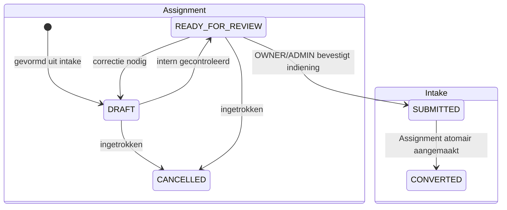

# Ontwerp Module 5B.1 — Opdrachtvorming

- **Status:** geaccepteerd ontwerp; Module 5B.3 technisch gerealiseerd en product-ownergeaccepteerd, Module 5B.2 behoudt zijn afzonderlijke acceptatiestatus
- **Module:** 5B.1
- **Datum:** 13 juli 2026
- **Bronnen:** [Ontwerp Module 5](module-5-ontwerp.md), [implementatieplan Module 5A](module-5a-implementatieplan.md) en [ADR-005](adr/ADR-005-versieerbare-intake-en-antwoordhistorie.md)
- **Besluit:** [ADR-006](adr/ADR-006-transactionele-opdrachtvorming.md)
- **Afhankelijk van:** technisch gerealiseerde Module 5A.1, 5A.2 en 5A.3 en acceptatie van de eerste gepubliceerde vraagset
- **Buiten scope:** matching, aanbiedersselectie, credits, Mollie, AI, berichten, notificaties en bestandsuploads

## 1. Doel en afbakening

Module 5B.1 ontwerpt de gecontroleerde overgang van een volledige intake met status `READY_FOR_REVIEW` naar precies één opdracht (`Assignment`). De overgang is een expliciete indieningshandeling namens de opdrachtgeverorganisatie. Zij publiceert niets aan aanbieders en start geen matching.

Het ontwerp omvat:

- de lifecycle van intake, indiening en gevormde opdracht;
- server-side autorisatie en tenantcontrole;
- de herleidbare omzetting van gevalideerde intakegegevens naar opdrachtvelden;
- atomische, idempotente en concurrencyveilige transactieregels;
- foutafhandeling zonder informatielek;
- status-, wijzigings- en actorhistorie;
- de grens tussen immutable intakebron en wijzigbaar opdrachtconcept.

Dit document schrijft geen Prisma-wijziging of implementatie voor. Eventuele schemawijzigingen worden in een afzonderlijke implementatiestap als nieuwe controleerbare migratie uitgewerkt.

## 2. Hoofdbesluiten

1. Een `Assignment` ontstaat uitsluitend door expliciete indiening van een volledig geldige intake in `READY_FOR_REVIEW`.
2. Alleen een actuele `OWNER` of `ADMIN` van dezelfde actieve `CLIENT`- of `BOTH`-organisatie mag indienen.
3. De indiening zet de intake binnen één databasetransactie via `SUBMITTED` naar `CONVERTED` en maakt precies één `Assignment` met status `DRAFT`.
4. Een geslaagde conversie wordt niet teruggedraaid. Correctie gebeurt op het opdrachtconcept; intrekken gebeurt via `AssignmentStatus.CANCELLED`.
5. De intake, vraagsetversie, actuele antwoorden en antwoordrevisies blijven na conversie immutable en vormen de historische bron.
6. De unieke relatie op `Assignment.intakeId` is de laatste databasebrede waarborg tegen dubbele opdrachten; de service is daarnaast idempotent.
7. `MEMBER` mag een eigen intake gereedmaken en een daaruit gevormde opdracht bekijken, maar niet indienen, wijzigen, gereedmelden of annuleren.
8. Opdrachtvorming vult geen specialisme in, selecteert geen aanbieder en berekent geen score.

## 3. Lifecycle van intake naar opdracht

### 3.1 Voor indiening

- `DRAFT` en `IN_PROGRESS` blijven bewerkbare intakeconcepten volgens de bestaande Module 5A-regels.
- `READY_FOR_REVIEW` betekent dat de volledige validatie op dat moment is geslaagd. Deze status alleen is geen opdracht en reserveert niets.
- Een `MEMBER` kan een eigen intake naar `READY_FOR_REVIEW` brengen. Een `OWNER` of `ADMIN` kan iedere toegestane organisatie-intake gereedmaken of voor correctie terugzetten naar `IN_PROGRESS`.
- Zolang niet is ingediend, mag een bevoegde gebruiker de intake terugzetten naar `IN_PROGRESS`; iedere wijziging doorloopt daarna opnieuw de volledige gereedheidsvalidatie.

### 3.2 Moment van opdrachtvorming

Een `Assignment` ontstaat pas wanneer alle volgende voorwaarden in dezelfde server-side handeling opnieuw zijn vastgesteld:

1. de actor en accountstatus zijn actief;
2. de actor heeft een actieve `OWNER`- of `ADMIN`-membership bij de intakeorganisatie;
3. de organisatie is actief en heeft type `CLIENT` of `BOTH`;
4. de intake hoort bij die organisatie en staat in `READY_FOR_REVIEW`;
5. de aangeleverde intakeversie is nog actueel;
6. de vastgezette vraagsetversie en alle vereiste antwoorden zijn volledig en geldig;
7. gekoppelde opties en locatie horen nog bij de intake, vraagset en tenant;
8. er bestaat nog geen conflicterende opdracht voor de intake.

De bevestigde indieningsactie is daarmee het zakelijke ontstaansmoment van de opdracht. Het bereiken van `READY_FOR_REVIEW`, het openen van de controlepagina of het opslaan van een intake maakt nooit impliciet een opdracht.

### 3.3 Na conversie

- De intake eindigt in `CONVERTED` en is inhoudelijk niet meer wijzigbaar.
- De opdracht begint in `DRAFT` en is alleen intern zichtbaar binnen de bestaande autorisatieregels.
- `OWNER` en `ADMIN` mogen het opdrachtconcept corrigeren en naar `READY_FOR_REVIEW` brengen.
- Een opdracht in `READY_FOR_REVIEW` mag vóór latere publicatie weer naar `DRAFT` voor correctie.
- `OWNER` en `ADMIN` mogen een opdracht in `DRAFT` of `READY_FOR_REVIEW` intrekken. Intrekken vereist een korte reden en zet de status op `CANCELLED`; records worden niet verwijderd.
- `OPEN`, `MATCHING`, `AWAITING_RESPONSES`, `IN_SELECTION`, `AWARDED`, `CLOSED` en `ARCHIVED` zijn in Module 5B.1 niet bereikbaar via gebruikersacties.

## 4. Rollen en autorisaties

Een platformrol geeft zonder actuele organisatie-membership nooit toegang tot tenantgegevens.

| Handeling | `OWNER` | `ADMIN` | `MEMBER` |
| --- | --- | --- | --- |
| Eigen intake naar `READY_FOR_REVIEW` brengen | Ja | Ja | Ja |
| Iedere organisatie-intake controleren | Ja | Ja | Nee |
| `READY_FOR_REVIEW` terugzetten voor correctie | Ja | Ja | Alleen eigen intake volgens 5A-beleid |
| Intake indienen en opdracht vormen | Ja | Ja | Nee |
| Gevormde opdracht bekijken | Ja | Ja | Alleen uit eigen intake |
| Opdrachtconcept wijzigen | Ja | Ja | Nee |
| Opdracht naar `READY_FOR_REVIEW` brengen | Ja | Ja | Nee |
| Opdracht terugzetten naar `DRAFT` | Ja | Ja | Nee |
| Opdracht annuleren | Ja | Ja | Nee |

Voor iedere lees- en schrijfactie gelden opnieuw de controles op actieve gebruiker, accountstatus, membership, organisatiestatus, organisatietype, tenantrelatie en recordstatus. Een `organizationId`, `intakeId`, `assignmentId` of rol uit URL, cookie of formulier is uitsluitend invoer en nooit bewijs van bevoegdheid. Niet-toegankelijke records geven dezelfde veilige uitkomst als niet-bestaande records.

Wanneer de maker van de intake niet langer een actieve membership heeft, kunnen alleen een actuele `OWNER` of `ADMIN` van dezelfde organisatie de intake indienen. De voormalige maker krijgt geen toegang op basis van historisch eigenaarschap.

## 5. Statusmodel en toegestane overgangen

### 5.1 Intake

| Van | Naar | Actor | Regel |
| --- | --- | --- | --- |
| `READY_FOR_REVIEW` | `IN_PROGRESS` | `OWNER`, `ADMIN`; eigen intake volgens bestaand 5A-beleid | Correctie vóór indiening; schrijft statushistorie. |
| `READY_FOR_REVIEW` | `SUBMITTED` | `OWNER`, `ADMIN` | Alleen als eerste stap binnen de conversietransactie. |
| `SUBMITTED` | `CONVERTED` | Dezelfde indienende actor | Alleen nadat de opdracht in dezelfde transactie is aangemaakt. |

`SUBMITTED` is geen langdurige of door de gebruiker herstelbare toestand. De status kan als tussenupdate in de transactie bestaan en beide overgangen worden wel afzonderlijk in `IntakeStatusHistory` vastgelegd. Mislukt een vervolgstap, dan rolt ook `SUBMITTED` terug en blijft de intake `READY_FOR_REVIEW`.

### 5.2 Assignment

| Van | Naar | Actor | Regel |
| --- | --- | --- | --- |
| geen | `DRAFT` | Indienende `OWNER`/`ADMIN` | Alleen vanuit een geldig geconverteerde intake. |
| `DRAFT` | `READY_FOR_REVIEW` | `OWNER`, `ADMIN` | Verplichte opdrachtvelden zijn geldig. |
| `READY_FOR_REVIEW` | `DRAFT` | `OWNER`, `ADMIN` | Correctie nodig; reden wordt vastgelegd. |
| `DRAFT` | `CANCELLED` | `OWNER`, `ADMIN` | Expliciete bevestiging en reden vereist. |
| `READY_FOR_REVIEW` | `CANCELLED` | `OWNER`, `ADMIN` | Expliciete bevestiging en reden vereist. |

Andere overgangen worden centraal geweigerd. Pagina’s en Server Actions mogen statussen niet rechtstreeks muteren.

## 6. Overname van gegevens

De intake blijft de immutable bron. De opdracht bevat alleen velden die nodig zijn om het opdrachtconcept zelfstandig te tonen en later gecontroleerd te verwerken. Iedere afleiding is deterministisch, zonder AI, en gebruikt uitsluitend op het transactiemoment opnieuw gevalideerde waarden.

### 6.1 Gegevens die naar `Assignment` worden overgenomen

| Assignmentveld | Bron | Besluit |
| --- | --- | --- |
| `intakeId` | `Intake.id` | Verplicht voor deze flow en uniek; bewaart de herkomst. |
| `clientOrganizationId` | `Intake.clientOrganizationId` | Verplicht en nooit afkomstig uit formulier of cookie. |
| `createdByUserId` | Indienende actor | De indiener vormt de opdracht namens de organisatie; de oorspronkelijke intakemaker blijft op `Intake.createdByUserId` beschikbaar. |
| `title` | Actueel antwoord `HELP_REQUEST_DESCRIPTION` | Verplicht. Genormaliseerde eerste niet-lege tekstregel, afgekapt op een woordgrens tot maximaal 120 tekens; geen AI of inhoudelijke herschrijving. De indiener ziet de titel vóór bevestiging. |
| `description` | `HELP_REQUEST_DESCRIPTION`, `DESIRED_OUTCOME_DESCRIPTION` en `SITUATION_DESCRIPTION` | Verplicht. Deterministische plattetekstweergave met vaste Nederlandstalige sectielabels; geen HTML of AI-samenvatting. |
| `sectorId` | Actieve sectorrelaties van de organisatie | Alleen invullen wanneer precies één actieve sector ondubbelzinnig geldt; anders `null` en geen sector raden. |
| `employeeCount` | `AFFECTED_EMPLOYEE_COUNT` | Optioneel; alleen een geldige aanwezige waarde. |
| `desiredStartDate` | `PREFERRED_START_DATE` | Optioneel; alleen een geldige aanwezige datum. |
| `locationId` | `PRIMARY_LOCATION` | Verplicht behalve bij werkvorm `REMOTE`; de locatie moet actief zijn en bij dezelfde organisatie horen. |
| `allowsRemoteWork` | `PREFERRED_WORK_MODE` | `true` voor `HYBRID` en `REMOTE`; `false` voor `ON_SITE` en `NOT_SURE`. De oorspronkelijke nuance blijft in de intake staan. |
| `status` | Systeemwaarde | Altijd `DRAFT` bij ontstaan. |

De omzetting gebruikt geen vrije gebruikersinvoer voor identifiers, actorvelden, tenantvelden of status.

### 6.2 Gegevens die uitsluitend intakegegevens blijven

De volgende gegevens worden niet in een oneigenlijk Assignmentveld gedupliceerd en blijven via `Assignment.intakeId` herleidbaar:

- `Intake.freeText` als oorspronkelijke, immutable bronopname;
- `questionnaireVersionId`, vraagteksten, optiewaarden en categorieën;
- actuele antwoorden en alle `IntakeAnswerRevision`-records;
- onderwerpen (`HELP_REQUEST_TOPICS`), impactgebieden en globale inzetomvang;
- de volledige urgentiekeuze en werkvormkeuze;
- `CONSTRAINTS_DESCRIPTION`; deze blijft context en wordt niet automatisch aan de opdrachtomschrijving toegevoegd;
- intakestatushistorie, maker, gereedmeldactoren en eerdere antwoordactoren;
- `detectedSpecialismId`, dat in Module 5 leeg blijft.

Toekomstige matching leest deze gegevens via de bronintake en stabiele vraag-/optiekeys. Module 5B.1 kopieert ze niet naar scorevelden en maakt geen nieuwe matchinginterpretatie.

### 6.3 Velden die bij opdrachtvorming leeg blijven

- `primarySpecialismId` en `AssignmentSpecialism`: geen specialisme raden of automatisch afleiden;
- `responseDeadline`: hoort bij een latere publicatie-/matchingbeslissing;
- `publishedAt`, `closedAt` en `archivedAt`;
- providerselecties, score, score-uitleg en resolutie.

## 7. Verplichte gegevens

### 7.1 Vereist vóór indiening

De bestaande volledige intakevalidatie blijft leidend. Minimaal zijn geldig aanwezig:

- `HELP_REQUEST_DESCRIPTION` van 20–2.000 tekens;
- één tot drie geldige `HELP_REQUEST_TOPICS`-opties;
- `DESIRED_OUTCOME_DESCRIPTION` van 10–1.500 tekens;
- `SITUATION_DESCRIPTION` van 20–3.000 tekens;
- één geldige `SUPPORT_URGENCY`-optie;
- één geldige `PREFERRED_WORK_MODE`-optie;
- een actieve `PRIMARY_LOCATION` van dezelfde organisatie, tenzij `PREFERRED_WORK_MODE` gelijk is aan `REMOTE`.

De service valideert ook alle aanwezige optionele antwoorden. Een ongeldig optioneel antwoord wordt niet genegeerd maar blokkeert de indiening totdat het is gecorrigeerd of verwijderd.

### 7.2 Vereist op de gevormde opdracht

- `intakeId`;
- `clientOrganizationId`;
- `createdByUserId` van de indiener;
- `title`;
- `description`;
- `status = DRAFT`;
- creatietijd;
- `version = 1` voor optimistische concurrency;
- herleidbare indieningsmetadata op de intake: `submittedAt`, `submittedByUserId` en `convertedAt`.

`sectorId`, `employeeCount`, `desiredStartDate`, `locationId` bij volledig op afstand, `primarySpecialismId` en `responseDeadline` zijn niet algemeen verplicht. Voor `DRAFT` naar `READY_FOR_REVIEW` gelden dezelfde kernvelden en opnieuw geldige tenant-/locatierelaties.

## 8. Transactieregels

De opdrachtvormingsservice voert conceptueel de volgende stappen uit binnen één PostgreSQL-transactie:

1. laad de intake met huidige antwoorden, opties, vraagsetversie en tenantrelaties;
2. controleer actor, account, membership, rol, organisatie en organisatietype;
3. conditioneer de mutatie op `intake.id + intake.version + READY_FOR_REVIEW`;
4. voer de volledige dynamische intakevalidatie opnieuw uit;
5. controleer of een gekoppelde opdracht bestaat;
6. leg de overgang `READY_FOR_REVIEW` naar `SUBMITTED` met actor en tijd vast;
7. maak de `Assignment` met deterministisch afgeleide velden en status `DRAFT`;
8. leg de initiële opdrachtstatus `null` naar `DRAFT` en de eerste opdrachtrevisie vast;
9. zet de intake van `SUBMITTED` naar `CONVERTED`, verhoog de intakeversie en leg `submittedAt`, `submittedByUserId` en `convertedAt` vast;
10. schrijf de tweede intakestatusovergang;
11. commit en geef het bestaande of nieuw gevormde assignment-ID terug.

Iedere stap is onderdeel van dezelfde transactie. Er bestaat geen toestand waarin de intake duurzaam `SUBMITTED` is zonder opdracht of waarin een opdracht bestaat terwijl de intake niet `CONVERTED` is.

### 8.1 Optimistische concurrency

- De actie levert de laatst bekende `Intake.version` aan.
- De conditionele statusmutatie slaagt alleen bij exact die versie en `READY_FOR_REVIEW`.
- Bij nul gewijzigde rijen herlaadt de service uitsluitend binnen de geautoriseerde tenantcontext om onderscheid te maken tussen een veilige idempotente herhaling en een echt conflict.
- Een achterhaalde aanvraag overschrijft niets en krijgt een herkenbare, veilige conflictmelding.

### 8.2 Idempotentie en dubbele opdrachten

Dubbele opdrachtvorming wordt op drie niveaus voorkomen:

1. **Domeinregel:** alleen `READY_FOR_REVIEW` mag worden geconverteerd.
2. **Serviceregel:** een herhaalde aanvraag voor een al consistent `CONVERTED` intake retourneert de reeds gekoppelde opdracht en maakt niets nieuws.
3. **Databaseconstraint:** `Assignment.intakeId` blijft uniek, ook bij twee gelijktijdige transacties.

Als de unieke constraint door een race wordt geraakt, herlaadt de service na rollback de bestaande opdracht binnen dezelfde geautoriseerde tenantcontext. Alleen wanneer intake en opdracht samen de verwachte consistente eindtoestand hebben, geldt dit als idempotent succes. Iedere andere combinatie is een integriteitsfout en wordt niet automatisch gerepareerd.

### 8.3 Transactie-isolatie

De implementatiestap gebruikt een conditionele update en unieke constraint als minimale waarborg. Wanneer integratietests aantonen dat dit onder de gekozen Prisma-/PostgreSQL-transactiegrens onvoldoende onderscheid geeft, wordt de intake daarnaast rijvergrendeld of de transactie op `Serializable` uitgevoerd met begrensde retry. Een retry voert altijd alle autorisatie- en validatieregels opnieuw uit.

## 9. Terugdraaien, corrigeren en annuleren

### 9.1 Vóór indiening

Een intake in `READY_FOR_REVIEW` mag voor correctie terug naar `IN_PROGRESS`. De gebruiker vult de intake aan en laat de volledige validatie opnieuw uitvoeren.

### 9.2 Na geslaagde conversie

Conversie is niet terug te draaien:

- de assignmentrelatie wordt niet verwijderd;
- de intake gaat niet terug van `CONVERTED` naar een bewerkbare status;
- antwoorden en antwoordrevisies worden niet herschreven;
- een nieuwe intake is nodig wanneer de oorspronkelijke hulpvraag wezenlijk verandert.

Zakelijke correcties op dezelfde hulpvraag gebeuren op `Assignment` in `DRAFT`. Iedere wijziging verhoogt de opdrachtversie en schrijft een append-only opdrachtrevisie. De opdracht kan daarna opnieuw intern worden gecontroleerd.

Een niet meer gewenste opdracht wordt `CANCELLED`. De annuleringsreden is verplicht, wordt apart van de opdrachtomschrijving vastgelegd en komt in de statushistorie. Annuleren verwijdert of anonimiseert geen historie.

## 10. Audit en historie

Module 5B vereist zakelijke historie die losstaat van een latere algemene beheer-auditinterface.

### 10.1 Intakehistorie

- `IntakeStatusHistory` legt zowel `READY_FOR_REVIEW → SUBMITTED` als `SUBMITTED → CONVERTED` append-only vast;
- beide regels bevatten dezelfde indienende actor en transactionele tijdcontext;
- `submittedAt`, `submittedByUserId` en `convertedAt` bieden directe herleidbaarheid op de intake;
- intakeantwoorden en antwoordrevisies worden na conversie niet gewijzigd.

### 10.2 Opdrachthistorie

- `AssignmentStatusHistory` legt ontstaan (`null → DRAFT`) en iedere latere overgang append-only vast;
- iedere statusovergang bevat actor, tijdstip en een begrensde reden waar die verplicht is;
- een `Assignment.version` ondersteunt optimistische concurrency;
- een append-only `AssignmentRevision` legt bij ontstaan en iedere wijziging een snapshot van de zakelijke opdrachtvelden vast;
- revisies bewaren geen cookies, tokens, secrets, requestmetadata of volledige gebruikersprofielen;
- vrije tekst, antwoorden en opdrachtinhoud komen niet in applicatielogs.

De concrete bewaartermijnen, anonimisering en toegang tot auditgegevens worden vóór productie in het AVG- en bewaarbeleid vastgesteld. Een bewaartermijn mag de referentiële integriteit en vereiste zakelijke historie niet stilzwijgend doorbreken.

## 11. Foutscenario’s

| Scenario | Technische reactie | Veilige gebruikersuitkomst |
| --- | --- | --- |
| Niet ingelogd of account niet actief | Stop vóór gegevensgebruik; bestaande authafhandeling. | Aanmelden of generieke toegangsweigering. |
| Geen actieve membership of verkeerde tenant | Geen mutatie en geen bestaansbevestiging. | “Deze hulpvraag is niet beschikbaar.” |
| Rol `MEMBER` probeert in te dienen | Autorisatie faalt vóór conversie. | “U mag deze hulpvraag niet indienen.” |
| Organisatie is `SUSPENDED`, `ARCHIVED` of alleen `PROVIDER` | Geen mutatie. | “Uw organisatie kan deze hulpvraag nu niet indienen.” |
| Intake staat niet in `READY_FOR_REVIEW` | Geen mutatie. | “Controleer de hulpvraag voordat U deze indient.” |
| Verplichte of optionele invoer is ongeldig | Volledige validatie faalt; geen statuswijziging. | Gerichte veld-/sectiefouten zonder technische details. |
| Intakeversie is achterhaald | Concurrencyconflict; niets overschrijven. | “De hulpvraag is intussen gewijzigd. Vernieuw de pagina en controleer opnieuw.” |
| Dubbele klik of herhaald request na succes | Bestaande consistente opdracht teruggeven. | Eén geslaagde indiening en één opdracht. |
| Gelijktijdige geldige indieningen | Eén transactie wint; de andere wordt idempotent of conflict. | Nooit twee opdrachten. |
| Opdracht bestaat maar intake is niet `CONVERTED`, of omgekeerd | Integriteitsfout; geen automatische reparatie. | Algemene veilige foutmelding en operationeel onderzoek. |
| Afleiding van titel of omschrijving faalt | Volledige rollback. | “De hulpvraag kon niet worden ingediend. Probeer het opnieuw.” |
| Database- of netwerkfout tijdens transactie | Volledige rollback; veilige technische logging zonder inhoud. | De intake blijft `READY_FOR_REVIEW`; opnieuw proberen is veilig. |
| Ongeldige opdrachtstatusovergang | Centrale policy weigert mutatie. | Statusspecifieke, veilige melding. |

Technische logging mag foutcode, operatienaam en niet-gevoelige correlatie-informatie bevatten. Zij bevat geen antwoorden, vrije tekst, tokens, secrets of volledige persoonsgegevens.

## 12. Implementatiegrenzen voor een volgende stap

Een latere Module 5B-implementatie mag pas starten na acceptatie van dit ontwerp en moet afzonderlijk uitwerken:

- een nieuwe Prisma-migratie voor ontbrekende actor-, tijd-, versie- en historievelden;
- centrale assignmentpolicy, autorisatiehelpers en opdrachtvormingsservice;
- dunne Server Actions voor indienen, corrigeren, gereedmelden en annuleren;
- opdrachtpagina’s en toegankelijke bevestigings- en foutstates;
- unit-, service-, database-, concurrency- en tenantisolatietests;
- updates van architectuur, datadictionary, ERD, roadmap, voortgang, risico’s, technical debt en changelog.

De databasefundering en server-side conversieservice zijn in Module 5B.2 gerealiseerd. Module 5B.3 ontsluit deze service via een aparte server-rendered bevestigingspagina en dunne Server Actions. De acties lezen gebruiker en actieve organisatie server-side en vertrouwen geen tenant- of rolvelden uit formulieren. Na idempotent succes volgt een opnieuw geautoriseerde succesroute. `OWNER` en `ADMIN` kunnen toegestane zakelijke velden in `DRAFT` wijzigen, intern gereedmelden, met een reden van 10 tot en met 500 tekens terugzetten en na expliciete bevestiging annuleren. Publicatie en matching blijven uitgeschakeld.

## 13. Acceptatiecriteria voor het ontwerp

- het ontstaansmoment van `Assignment` is eenduidig en expliciet;
- `OWNER`, `ADMIN` en `MEMBER` hebben een volledige, server-side afdwingbare rollenmatrix;
- alle gekopieerde, afgeleide en uitsluitend historische intakegegevens zijn benoemd;
- de transactie kan geen gedeeltelijke conversie opleveren;
- dubbele of gelijktijdige indiening kan maximaal één opdracht vormen;
- terugdraaien, corrigeren en annuleren hebben afzonderlijke regels;
- status- en inhoudshistorie blijven herleidbaar zonder gevoelige logging;
- matching, aanbieders, credits, Mollie en AI zijn niet impliciet geactiveerd.

## 14. Openstaande vragen

De kernbesluiten voor opdrachtvorming zijn in dit ontwerp expliciet gemaakt. Voor implementatie of productie blijven de volgende afgeleide punten open:

1. De product owner moet de zichtbare titelafleiding en vaste sectielabels van de opdrachtomschrijving inhoudelijk goedkeuren.
2. De maximale lengte en toegestane waardelijst voor een annuleringsreden moeten bij het implementatieplan worden vastgesteld.
3. Het toekomstige AVG- en bewaarbeleid moet termijnen voor intakes, antwoordrevisies, opdrachten en opdrachtrevisies bepalen.
4. De latere publicatie-/matchingmodule moet beslissen wanneer `responseDeadline`, `primarySpecialismId` en eventuele `AssignmentSpecialism`-relaties worden ingevuld.
5. De product owner moet de eerste gepubliceerde vraagset nog inhoudelijk accepteren; zonder die acceptatie mag productiegebruik van opdrachtvorming niet starten.
