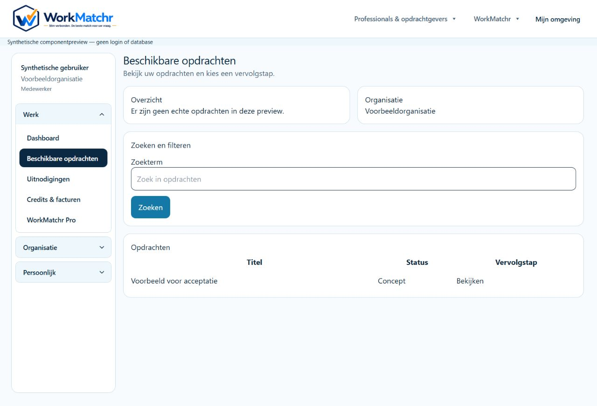
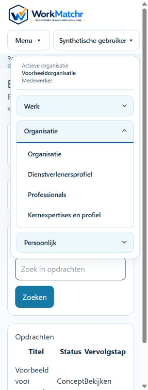

# A01.7 — Uniforme accountlayout

Issue: [#22](https://github.com/WorkMatchr/platform/issues/22). Basis: origin/main `2510c2434ea822023c9b2519c24222f090ff1226`, inclusief de goedgekeurde Platformbeheer-v0.2-port uit PR #21.

## Implementatie en vergelijking

De reguliere werkruimtes behouden ApplicationChrome, HeaderModel, AccountNavigationMenu en AccordionNavigation. De nieuwe afgebakende CSS-module hergebruikt via CSS Modules composition letterlijk de contentstijl van Platformbeheer v0.2. Breedte 100rem, zijbalk 14rem, hoofdafstand 1rem, compacte koppen/kaarten/tabelcellen, bestaande design tokens en donkerblauwe actieve route. Geen kopie van dashboardqueries, formulieren of acties.

De bestaande mobiele DisclosureMenu behoudt open/dicht, Escape, focusherstel en sluiten bij navigatie. De bestaande accordion opent de actieve groep en behoudt handmatige bediening. Account- en organisatiecontext blijven zichtbaar. De publieke headerbestemmingen blijven beschikbaar; Platformbeheer zelf wordt niet gewijzigd.

Het providerdossier heeft reeds een eigen lokale navigatie. Deze blijft bestaan; binnen de uniforme shell stapelt die onder 1280px om een te smal formulier tussen twee zijbalken te voorkomen. Geen dossierstap of actie verwijderd.

## Account- en routematrix

| Context | Werk | Organisatie | Persoonlijk |
| --- | --- | --- | --- |
| Opdrachtgever OWNER/ADMIN | Dashboard, Opdrachten, Adviesdossiers, Mijn Arbo-wijzers | Organisatie, Medewerkers | Account, Notificaties, Uitloggen |
| Opdrachtgever MEMBER | Zelfde bestaande leesbestemmingen; server bepaalt datatoegang | Organisatie, geen beheerlink Medewerkers | Account, Notificaties, Uitloggen |
| Dienstverlener OWNER/ADMIN | Dashboard, Beschikbare opdrachten, Uitnodigingen, Credits & facturen, WorkMatchr Pro | Organisatie, Medewerkers, Dienstverlenersprofiel, Professionals, Kernexpertises en profiel | Account, Notificaties, Uitloggen |
| Dienstverlener MEMBER | Bestaande bestemmingen, bestaande serverbeperkingen | Organisatie, Dienstverlenersprofiel, Professionals, Kernexpertises en profiel; alleen bestaande toegestane weergave | Account, Notificaties, Uitloggen |
| Platformbeheer | Bestaande zeven hoofdstukken en eigen bevoegdheden uit PR #21 | Ongewijzigd | Ongewijzigd |
| Student/LMS | Niet aanwezig op actuele main | Niet aanwezig | Geen nieuwe accountclaim gemaakt |

Op main bestaan alleen AccountType CLIENT en PROFESSIONAL. `/e-learning` en cursusdetails zijn publieke informatiepagina’s; `docs/public-learning-roadmap.md` sluit enrollment, voortgang, toetsen en certificaatuitgifte expliciet uit. De ongecommitte LMS-experimenten in de oorspronkelijke werkmap worden niet meegenomen. Geen fictieve Mijn opleidingen-/certificaatlinks toegevoegd.

Reacties, offertes en berichten hebben contextuele detailroutes, geen algemeen overzicht dat veilig aan het menu toegevoegd kan worden. Zij blijven via de bestaande opdrachten/uitnodigingen bereikbaar. Kernexpertises verwijst naar het bestaande providerprofiel; de maximaal-drieregel blijft in de bestaande domeinlogica.

## Shellbereik en beveiliging

De bestaande routeprefixlijst in ApplicationChrome is ongewijzigd: aanbiedersdossier, aanvragen, account, adviesdossiers, berichten, credits, dashboard, hulpvragen, marktplaats, mijn-arbo-wijzers, notificaties, offertes, opdrachten, organisatie, professional en uitnodigingen. Alleen een gevalideerd ingelogd niet-platformaccount krijgt daar de account-shell. Publieke content, Advieswijzer en e-learning blijven buiten de shell. Platformbeheer behoudt de eigen layout en versiecookie.

HeaderModel ontvangt de bestaande server-side gevalideerde context. De nieuwe Medewerkers-link geldt alleen voor OWNER/ADMIN met organisatie; dit verleent geen recht. Alle bestaande route-/serviceautorisatie, tenantfilters, lidmaatschapscontrole, accountstatus, Better Auth en logout blijven ongewijzigd. Ook API-contracten, prijzen, matching, migrations, secrets en productiegegevens blijven ongewijzigd.

## Validatie

De definitieve resultaten staan hieronder. De eerste gerichte run had 158 geslaagde assertions maar een worker-starttimeout; die run geldt niet als volledig groen.

Browserbewijs wordt onderscheiden van ingelogde acceptatie: een tijdelijke lokale componentpreview rendert de echte Header, ApplicationChrome, navigatie en CSS met synthetische gegevens. Zij heeft geen database, sessie of werkende publicatie-/uitlogactie en wordt niet gecommit. Daarmee zijn layout/reflow en menu-interacties te controleren, niet tenanttoegang of echte logout.

## Productreview en handmatige acceptatie

PC-015/020: Nederlandse rolgebonden termen en u/uw behouden; Aanvragen in het providermenu verduidelijkt naar Beschikbare opdrachten. PC-052/054: geen platformfuncties voor reguliere accounts. PC-062/063: bestaande keyboardbediening behouden, responsive controle en echte 200%-zoom afzonderlijk rapporteren. PC-066: bestaande tokens/componenten en letterlijk hergebruik van de goedgekeurde compacte contentstijl. PC-073/075: geen releasegereedclaim zonder ingelogde rol- en browseracceptatie.

Nog door Product Owner te accepteren: opdrachtgever en dienstverlener OWNER/ADMIN/MEMBER op dashboard, organisatie, opdrachten, dossier en account; login/herlogin/logout, beveiligde detailroutes en tenantisolatie; desktop, tablet, 390px, 320px, echte 200%-zoom. Platformbeheer v0.2 regressie. Student is niet van toepassing op deze main, geen nieuwe LMS-functionaliteit.

## Veilige release en rollback

Draft PR, geen automatische merge of productie-deployment. Na review, groene taakcontroles en Product Owner-acceptatie: release-SHA controleren, normale mergeprocedure volgen (main kan automatisch naar Vercel Production deployen), READY en exacte live SHA verifiëren en rolmatrix opnieuw controleren. Geen migratie vereist.

Presentatierollback: bouw dezelfde versie met `NEXT_PUBLIC_ACCOUNT_LAYOUT_VERSION=legacy` om de eerdere account-shell-v0.2-presentatie te gebruiken. De reeds bestaande `NEXT_PUBLIC_ACCOUNT_SHELL_VERSION=v01` blijft daarnaast werken. Deze opdracht wijzigt geen gedeployde environmentwaarden. Volledige rollback inclusief de extra navigatielinks: revert uitsluitend de A01.7-commit via een gereviewde PR. Platformbeheer blijft bytegewijs ongewijzigd.

## Visueel componentbewijs

Geen ingelogde of productiegegevens. Desktop 1280px en mobiele navigatie op 320px, echte componenten met synthetische context. Aanvullend 390px en tablet 820px gecontroleerd: documentbreedte overschrijdt viewport niet. Tab en Enter bedienen groepen; Escape sluit het mobiele menu en herstelt zichtbare triggerfocus. De browsertool bevestigde geen echte zoomwijziging; 200% blijft open.

## Wijzigingsset

- docs/README.md
- docs/uniform-account-layout-v02.md
- docs/images/a017/desktop.jpg
- docs/images/a017/mobile.jpg
- src/app/aanbiedersdossier/layout.tsx (uitsluitend CSS-scopeattribuut)
- src/components/layout/application-chrome.tsx
- src/components/layout/header-model.ts
- src/components/layout/header-model.test.ts
- src/components/layout/uniform-account-shell.module.css
- src/components/layout/uniform-account-shell.test.tsx

### Technische resultaten

- Volledige `npm run lint`: PASS.
- `npm run typecheck -- --incremental false --pretty false`: uitsluitend de vier bekende TS2345 readonly-arrayfouten in `src/lib/compliance/rule-engine.test.ts` op 13:79, 14:89, 23:8 en 24:89. Compliancebron en tests zijn identiek aan origin/main; eerdere geïsoleerde main-check documenteert exact dezelfde diagnostiek.
- `npm run build`: PASS, inclusief Next.js TypeScript en routegeneratie. Alleen bestaande Knowledge Engine file-tracingwaarschuwing. Synthetische procesconfiguratie, geen databaseverbinding.
- Gerichte herhaling: 30/30 tests in vijf bestanden PASS (uniforme shell, HeaderModel, rol-integratie, mobiele interactie, eerdere account-shell). Eerste brede gerichte pass: 158 geslaagde tests; één worker-starttimeout, hersteld door afzonderlijke herhaling met één worker. Geen assertion versoepeld.
- Volledige repo-suite (npm test -- --maxWorkers=1): 2078 PASS, 11 FAIL, 12 SKIPPED; 309 suites PASS, 11 suites FAIL, 1 SKIPPED. De 11 falende suites omvatten twee inlaadproblemen; dit is geen volledig groene suite. Baselinevergelijking gebruikt de schone bronboom `6786226`, die qua Git-tree identiek is aan main `2510c24`.
- Diff-check en secrets-patrooncontrole: PASS. Screenshotbestanden bevatten uitsluitend synthetische componentdata. Platformbeheer, authenticatie-/autorisatieservices, Prisma, package.json en lockfile zijn ongewijzigd.

### Bevestigde baselinefailures

Alle hieronder genoemde suites zijn gericht opnieuw uitgevoerd op de main-identieke bronboom, zonder A01.7-wijzigingen. Dezelfde inhoudelijke fouten treden daar op; Mollie-timeouts zijn daarnaast belastinggevoelig (in de baselinerun meer timeouts). Geen testverwachtingen, timeoutbudgetten of veiligheidschecks aangepast.

| Bestand | Concrete bestaande fout |
| --- | --- |
| ops/marketplace-notifications/dispatch.test.mjs | Node-testbestand door Vitest verzameld: no test suite found |
| src/components/public/public-intake-understanding-confirmation.test.tsx | server-only package/testconfig ontbreekt |
| src/content/public-content-platform.test.ts | Bedrijfsarts 728 woorden versus limiet 575 |
| src/app/public-platform-pages.test.tsx | Oude CTA-verwachting Stel uw vraag |
| src/components/public/public-content-pathways.test.tsx | Oude CTA-verwachting Stel uw vraag |
| src/app/frontpage-v02/page.test.tsx | Oude verwachting Stap 1 van 3 |
| src/lib/assignments/assignment-query-service.test.ts | Twee verouderde fixture-/queryverwachtingen: ownerfilter en ontbrekende specialisms |
| src/lib/finance/pro-mollie-recurring.test.ts | Testtimeout van 5000ms, ook op main |
| src/lib/finance/subscription-cancellation.test.ts | Twee datumverwachtingen gebruiken 9 september terwijl actuele klok 9 oktober is |
| src/lib/public-intake/public-intake-context-question-service.test.ts | Verwachte afwijzing blijft uit, ook op main |
| src/lib/public-intake/public-intake-guidance-presentation.test.ts | Verwachte additional requirement ontbreekt, ook op main |

Releasegereed: NEE. De implementatie is gereed voor review als Draft PR; echte ingelogde rolacceptatie/tenantcontrole en 200% moeten worden voltooid, en de bestaande rode checks moeten volgens de normale reviewprocedure worden behandeld. Geen nieuwe taakgerelateerde fout aangetoond.

## Vervolgcorrectie issue #22 — Uitloggen in de header

Voor alle ingelogde reguliere accounts staan Mijn omgeving en de bestaande LogoutButton nu samen rechts in de header, ook mobiel. Het accountmenu (desktopzijbalk én mobiele disclosure) bevat geen tweede uitlogactie meer. De eigen Platformbeheer-v01/v02-headers blijven ongewijzigd; ApplicationChrome onderdrukt daar nog steeds de globale header. Buiten die beheerroutes krijgt een ingelogde beheerder eveneens één headerknop. Anonieme bezoekers krijgen geen uitlogactie.

LogoutButton, Better Auth signOut, pending-/disabledgedrag en redirect naar `/` zijn ongewijzigd. Geen auth-, autorisatie-, database- of configuratiewijziging. Visuele rollback via revert van uitsluitend deze vervolgcommit; geen migratie.

Validatie: 67/67 gerichte tests PASS, inclusief echte LogoutButton met gemockte auth-transportgrens (één signOut, redirect pas na afronden, dezelfde bestemming). Synthetische echte-componentbrowserpreview: opdrachtgever desktop 1280px, mobiel 390px; dienstverlener 320px, geen pagina-overflow, knop ook zonder menu zichtbaar, geen duplicate bij geopend menu. Tab-focus zichtbaar; accessibility tree exposeert één button met naam Uitloggen. Dit is geen NVDA-/VoiceOver-spraaksessie en geen echte productie-uitlogactie. Beide eigen beheerdersshells aanvullend getest op precies één knop. Volledige lint, productiebuild, diff-check en secrets-patterncontrole PASS. Standalone TypeScript rapporteert uitsluitend de vier reeds gedocumenteerde TS2345 readonly-arraybaselinefouten in src/lib/compliance/rule-engine.test.ts (13:79, 14:89, 23:8, 24:89); dit bestand is identiek aan origin/main. Geen nieuwe TypeScript-fout uit deze wijziging.
